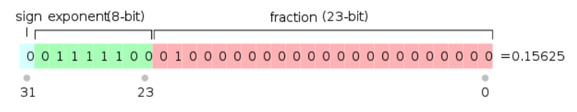

# Week 3 - Thursday 2019-04-18

## Java

#### Types

1. Type: a set of values and a set of operations
2. Abstract types:
    * Opaque
    * Must use methods (functions)
3. Exposed types:
    * Transparent
    * Users can look at values + reprs
    * Methods are nice too?

#### Float (C, Java)

* Floats in C and Java are represented as 32 bits
    * These 32 bits are split up as follows:
        * 1 signed bit (s)
        * 8 exponent bits (e)
        * 23 mantissa/fraction bits (f)

    { width=50% }

* Tiny Numbers
    * These numbers have a value $e = 0$
    * They have a value range of $2^{e-126}f$
    * Why have these numbers? With tiny numbers, underflow like this never happens

        ```c
        if (a != b && a -b == 0) {
            ouch();
        }
        ```
    * There are two values for zero: 0 and -0

        ```c
        if (a == b && memcmp(&a, &b, sizeof a )) {
            ouch();
        }
        ```
* Other values
    * When $e = 255$ and $f = 0$ you can have $\pm\text{inf}$
    * When $e = 255$, and $f \neq 0$ you can get `NaN`

#### Primitive vs Constructed Types

* Classic primitive types includes stuff like `bool, float, int, char, ...`
* Constructed Types: `String, Array, List, Map, int * float, etc...`
    * These are constructed by humans, and have a constructor

#### Uses of Types

1. Annotations (put these into your program)
    * Should be easier to understand
    * Compiler can generate more efficient code
2. Inference (look at at a var and figure out type)
    * In C/C++ for example there is the keyword `auto` which will let the compiler determine
        what the type of that variable should be

#### Type Checking

* Static type checking:
    * Happens at compile time
    * Has high levels of reliability and performance
    * Used by static-typed languages like C++, C, Java, etc
* Dynamic type checking
    * Checking occurs at runtime
    * Used by scripting languages like Javascript, python, and sh...
    * More flexible and simpler
* Strongly Typed
    * Cannot escape type checking
    * All operations' types are checked
    * No way to escape this
    * C++ is not strongly typed (can read int as char for example)

#### Type Equivalence

* Let === Mean same type
* Structural Equivalence (same representation)
    * Pass around during run time
* Name Equivalence (same name)

    ```c
    typedef int dollars;
    typedef int pennies;
    // Created two aliases for int
    // Here, dollars === pennies (structural equivalence)

    struct s { int val; struct s* next; };
    struct t { int val; struct t* next; };
    // Here, struct s !=== struct t (Here C uses name equivalence)
    ```

#### Subtypes

* Pascal:

    ```pascal
    type lc = 'a' ... 'c'
    var x:lc;
    var y:char;
    y := x; // Safe
    x := y; // Unsafe (runtime check will see if it works)
    ```

* Common Lisp:

    ```lisp
    (declare (type (and integer (satisfies evenp)) x))
    ```
* C++:
    * You can assign a child as the value to a variable of type parent, but not the other
        way around

        ```cpp
        class animal {
            ...
        }
        class mammal : animal {
            ...
        }
        mammal dog;
        animal a = dog; // Works
        ```
    * Can also do more with non-const pointers vs const pointers

        ```cpp
        char const *p;
        // You can't store through p
        // But you can change p

        char *o;
        o = p; // Invalid
        p = o; // Valid
        ```
    * Here, `char*` is a **subtype** of `char const*` since you can do more stuff with
        `char*`
    * `char const **` is a **subtype** of `char* const*`

#### Morphisms

* A morphism is a function that takes many forms
    * What data types does it accept and produce?
    * Ex: cosine in Fortran:
        * Can have `cos(float)`, `cos(double)`, are both ok
        * Two implementations: compiler will look at the type of argument and then choose
            the matching implementation of the function
        * This is implemented using **name mangling**
* Name Mangling: changes the name of the function at a lower level (machine code?)
* Overloading: essentially the same idea, lets you overload a function to take in many
    different types. The compiler will look at the code and determine which matching
    signature you want
* Coercion: implicit type conversion

    ```c
    float f;
    double d;
    d = f; // runtime action required, no information loss here
    f = d; // will lose information since double takes more memory
    ```

    * Problems with coercion: can cause problems with signed vs unsigned arithmetic

        ```c
        unsigned u;
        if (u <= -1) {
            ouch(); // This runs because int is coerced to unsigned
        }
        ```

#### Parametric Polymorphism

* Pioneered in ml (the predecessor to ocaml)
* The type of function can contain parameters

    ```ocaml
    length: 'a list -> int
    ```
* Form 1 (C++ and Ada): Templates
    * Write a template: a function with type variable
        * After instantiation at compile time, compiler replaces variables with real
            types.

    * An example in C++:

        ```cpp
        template <class T>
        T add(T a, T b) { return a + b; }
        ```
* Form 2: (ML, Ocaml, Java, ...)
    * Generics:
        * Looks similar to template, but is different
        * Compiler will see if this code will work no matter what the type is
        * Less code bloat (only one copy of the code)
        * All type checking is performed at once
