# Midterm Review

### Chapter 1 - Programming Languages

* Programming Languages are grouped into four families
    1. Imperative
    2. Functional
    3. Logic
    4. Object-Oriented
* Hallmarks of imperative languages
    * Assignments
    * Iteration
    * Order of execution is critical
* Hallmarks of functional languages
    * Single-valued variables
    * Heavy use of recursion
* Hallmarks of logic languages
    * Program expressed as rules in formal logic
* Hallmarks of object-oriented languages
    * Usually imperative
    * Constructs to help programmers use "objects" to do things
* Language Standards
    * Documents that define the language standards
    * Can be a slow and rancorous process

### Chapter 2 - Defining Program Syntax

* Syntax and Semantics
    * Programming language syntax: how programs look, their form and structure, defined
        by a formal grammar
    * Programming language semantics: what programs do, their behavior and meaning
* How the Grammar Works
    * The grammar is a set of rules that say how to build a parse tree
    * You put \<S\> at the root of the tree
    * The grammar’s rules say how children can be added at any point in the tree
* A Parse Tree of the Gramar:

    ```language
    <S> ::= <NP> <V> <NP>
    <NP> ::= <A> <N>
    <V> ::= loves | hates|eats
    <A> ::= a | the
    <N> ::= dog | cat| rat
    ```

    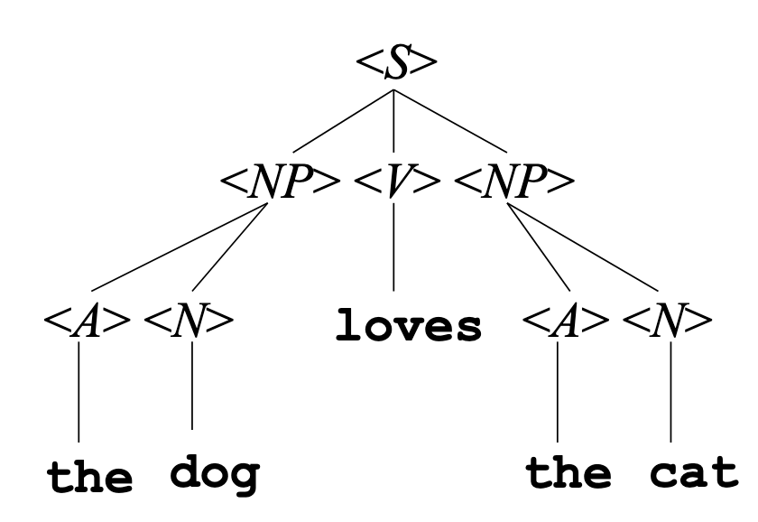{ width=30% }

* Programming Language Grammar
    * Here is an example expesssion:

        ```language
        <exp> ::= <exp> + <exp> | <exp> * <exp> | ( <exp> )
                            | a | b | c
        ```
    * An expression can be one of the variables a, b, or c or it can be a two expressions
        along with an operator
    * The parse tree for this looks like:

        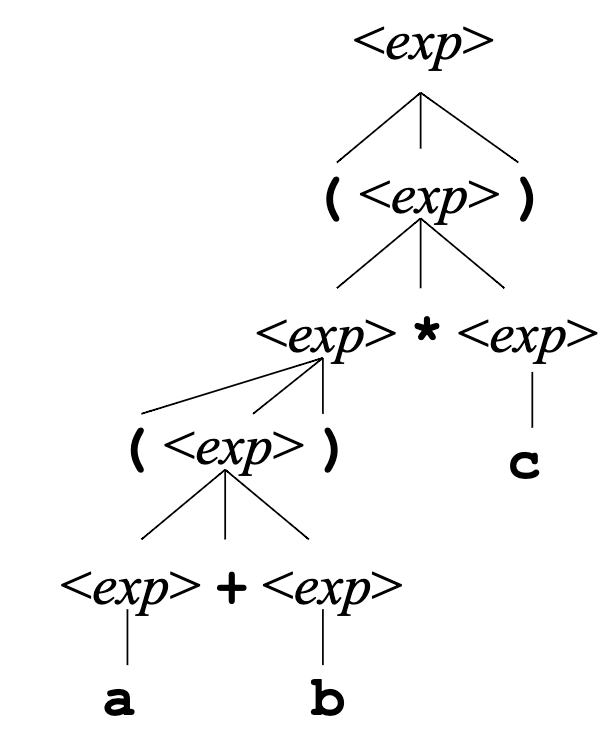{ width=30% }

* BNF Grammar Definition (4 parts)
    * Set of tokens
        * Tokens are smallest unit of syntax and are atomic - not treated as a
            composition of smaller pieces
    * Set of non-terminal symbols
        * They are strings enclosed in angle brackets, as in <NP>
        * They are not strings that occur literally in program text
        * Grammar specifies how these can be expanded out
    * Start symbol
        * the non-terminal that forms the root of any parse tree for the grammar
    * Set of productions
        * the tree-building rules
        * Each one has a non-terminal, the separator ::=, and a sequence of things which
            can be a tokens or a non-terminals
        * A production gives one possibility for building a parse tree, with each
            non-terminal having things to put as its children
        * Also possible in BNF grammar to seperate the possible right hand sides with |
* Empty
    * The special nonterminal <empty> is for places where you want the grammar to generate
        nothing
    * For example, this grammar defines a typical if-then construct with an optional else
        part

        ```language
        <if-stmt> ::= if <expr> then <stmt> <else-part>
        <else-part> ::= else <stmt> | <empty>
        ```
* Parse Trees
    * To build a parse tree, put the start symbol at the root
    * Add children to every non-terminal, following any one of the productions for that
        non-terminal in the grammar, finish when leaves are tokens
* Language Definition
    * The language defined by a grammar is the set of all strings that can be derived
        by some parse tree for the grammar
* Lexical Structure And Phrase Structure
    * Grammars so far have defined phrase structure: how a program is built from a
        sequence of tokens
    * We also need to define lexical structure: how a text file is divided into tokens
    * Usually this is dones with two seperate grammars - one on how to construct a
        sequence of tokens and one says how to construct the parse tree
* Seperate Compiler Passes
    * The scanner the input file and divides it into tokens according to the first
        grammar, discarding whitespace/comments
    * The parser then constructs the parse tree from the second grammar
* EBNF Variations
    * EBNF Adds Additional syntax to simplify some grammar chores
        - {x} to mean zero or more repetitions of x
        - `[x]` to mean x is optional (i.e. x | `<empty>`)
        - () for grouping
        - | anywhere to mean a choice among alternatives
        - Quotes around tokens, if necessary, to distinguish from all these meta-symbols
* EBNF Examples

    ```language
    <if-stmt> ::= if <expr> then <stmt> [else <stmt>]
    <stmt-list> ::= {<stmt> ;}
    <thing-list> ::= { (<stmt> | <declaration>) ;}
    <mystery1> ::= a[1]
    <mystery2> ::= ‘a[1]’

    ```
* Syntax Diagrams
    * Start with an EBNF grammar, a simple production is just a chain of boxes
    * For the grammar: `<if-stmt> ::= if <expr> then <stmt> else <stmt>`

        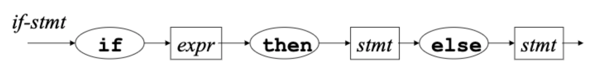{ width=50% }

    * Can also have Bypasses which are square-bracket pieces from the EBNF get
        paths that bypass them
    * So if you let the else be optional:
        `<if-stmt> ::= if <expr> then <stmt> [else <stmt>]` then

        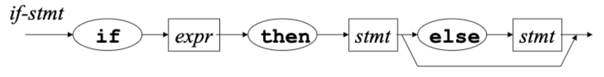{ width=50% }

    * Can also use branching for multiple productions, so for a grammar like

        ```language
        <exp> ::= <exp> + <exp> | <exp> * <exp> | ( <exp> )
                    | a | b | c
        ```
    * You can generate a parse tree:

        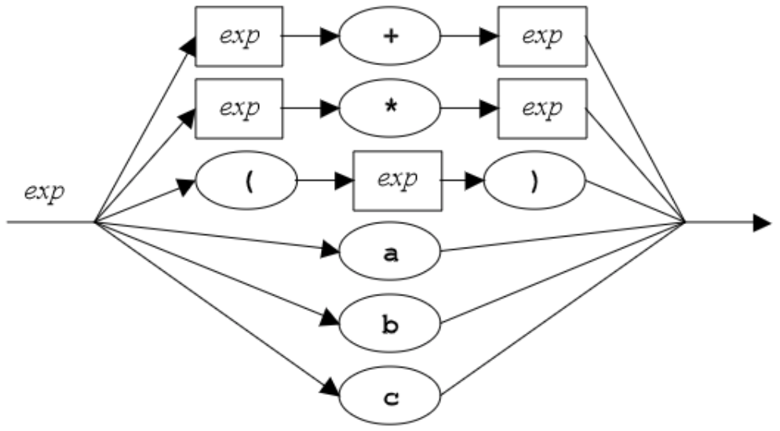{ width=50% }
    * Can also use Loops for EBNF curly brackets, like in the grammar

        ```grammar
        <exp> ::= <addend> {+ <addend>}
        ```
        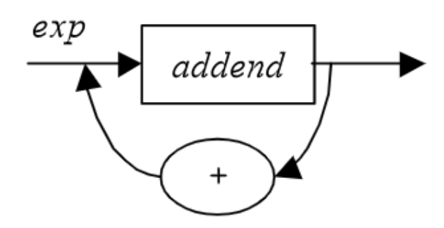{ width=30% }
    * Syntax Diagram Pros and Cons
        * Easier to read casually, but harder precisely
        * Harder to make machine readable

### Chapter 3 - Where Syntax Meets Semantics

* Here are Three equivalent grammars

    ```
    <subexp> ::= a | b | c | <subexp> - <subexp>

    <subexp> ::= <var> - <subexp> | <var>
    <var> ::= a | b | c

    <subexp> ::= <subexp> - <var> | <var>
    <var> ::= a | b | c
    ```
* These grammars all define the same language but have different syntax trees

    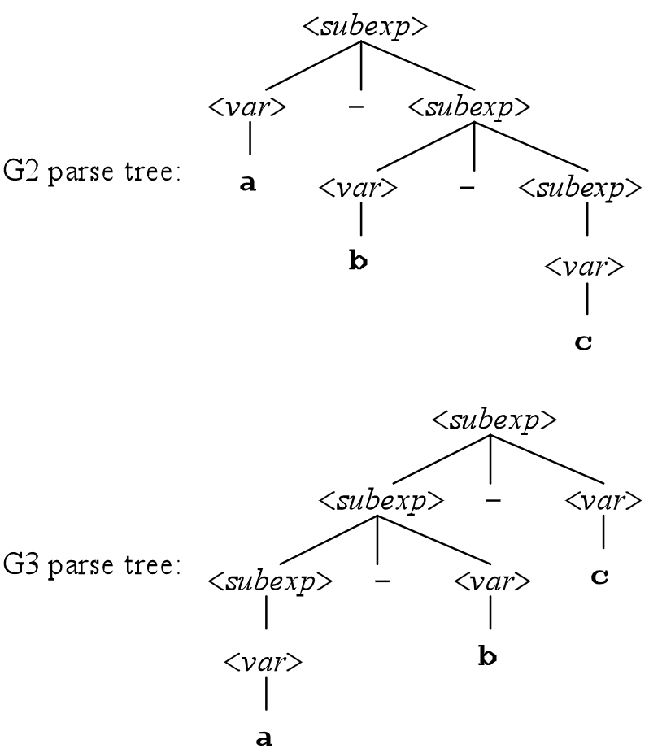{ width=25% }
* We want the structure of the parse tree to correspond to the semantics
    of the string it generates
* Precedence of Operators
    * Each operator has a precedence level, and those with higher precedence are
        performed first
* Precedence In Grammar
    * To fix the precedence problem, modify the grammar so it is forced to put *
        below + in the parse tree, so transform grammar as follows:

        ```grammar
        <exp> ::= <exp> + <exp>
                    | <exp> * <exp>
                    | (<exp>)
                    | a | b | c

        To:
        <exp> ::= <exp> + <exp> | <mulexp>
        <mulexp> ::= <mulexp> * <mulexp>
                        | (<exp>)
                        | a | b | c
        ```
    * Now our grammar will not generate parse trees with bad precedence

        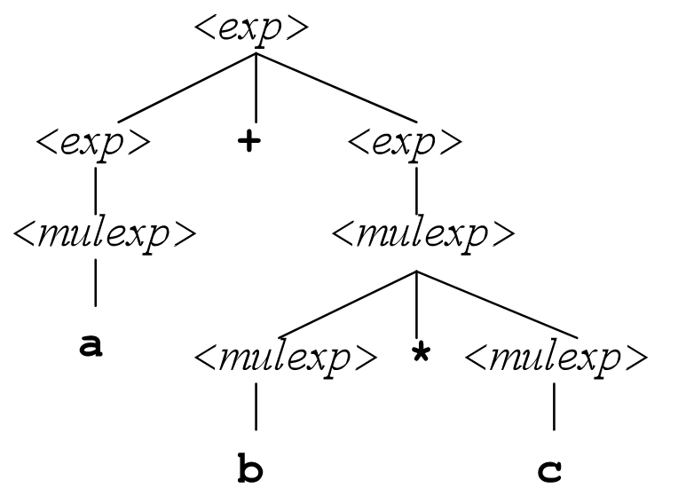{ width=30% }

* Operator Associativity
    * Left-associative operators group left to right: `a+b+c+d = ((a+b)+c)+d`
    * Right-associative operators group right to left: `a+b+c+d = a+(b+(c+d)`
    * Most operators in languages are left-associative
* Associativity in Grammar
    * To fix the associativity problem, we modify the grammar to make trees of `+s`
        grow down to the left (and likewise for `*s`)
    * Change the previous grammar to:

        ```
        <exp> ::= <exp> + <exp> | <mulexp>
        <mulexp> ::= <mulexp> * <rootexp> | <rootexp>
        <rootexp> ::= (<exp>)
                      | a | b | c
        ```
    * So the syntax tree is now:

        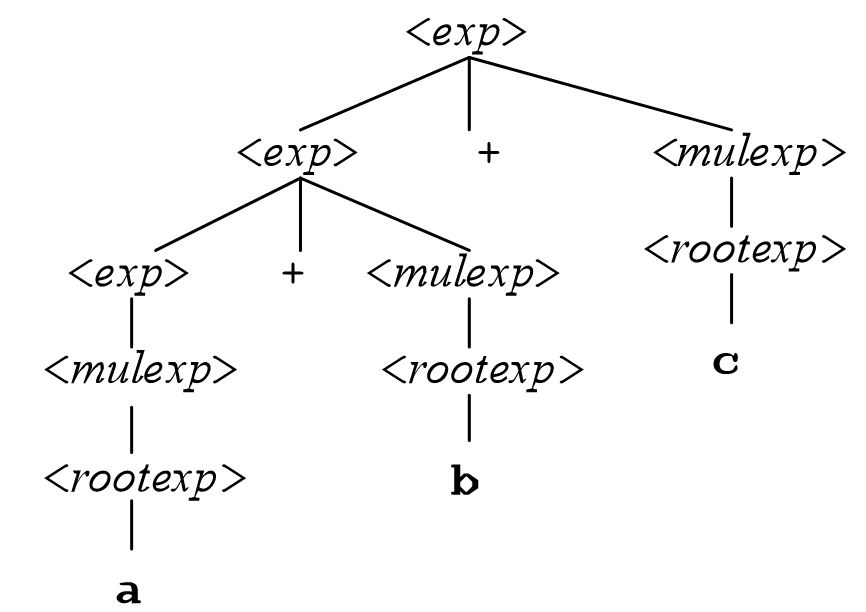{ width=20% }

* EBNF and Parse Trees
    * We have that {x} means "zero or more repetitions of x" in EBNF
    * So `<exp> ::= <mulexp> {+ <mulexp>}` should mean a `<mulexp>` followed by
        zero or more repetitions of `+ <mulexp>`
    * But what is that associativity?
    * One approach to this is to use {} whenever possible
    * Another approach is to use the form for left associative operators:
        `<exp> ::= <mulexp> {+ <mulexp>}`, or use explicitly recursive rules for these
        unconventional situations: `<expa> ::= <expb> [ = <expa> ]`
* Full-Size Grammars
    * Any realistic language has many non-terminals
    * Extra non-terminals guide construction of unique parse tree
    * Once parse tree is found, such non-terminals are no longer of interest
* Abstract Syntax Tree
    * Language systems usually store an abreviated version of the parse tree, the AST
    * Usually, there is a node for every operation, with a subtree for every operand

        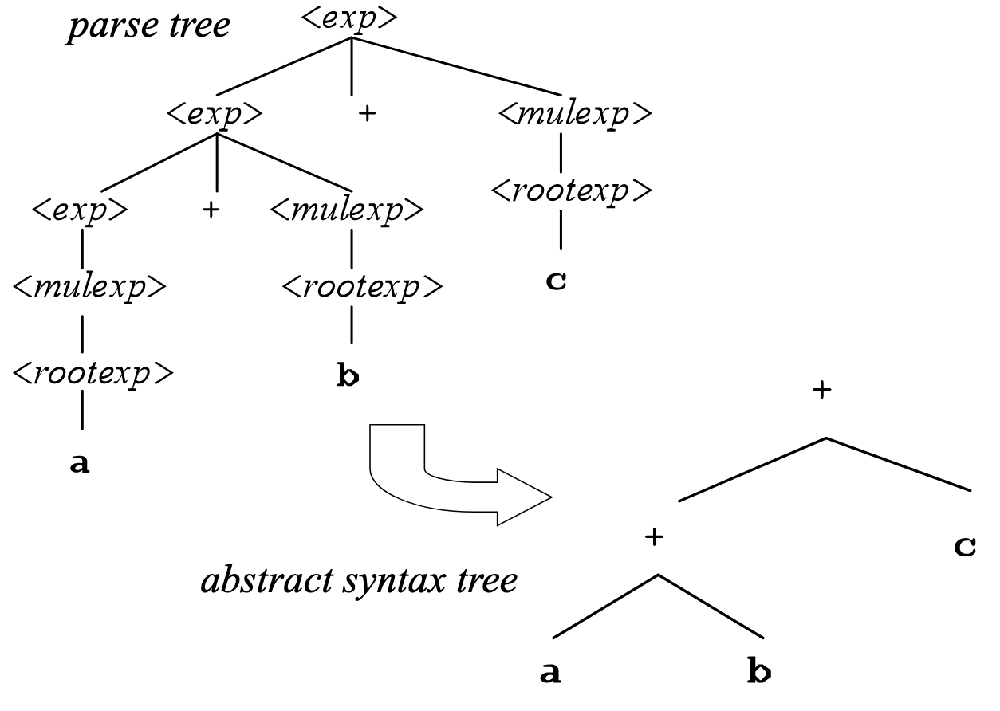{ width=50% }

* Parsing Revisited
    * When a language system parses a program, it goes through all the steps necessary to
        find the parse tree
    * But it usually does not construct an explicit representation of the parse tree in
        memory
    * Most systems construct an AST instead
* Grammars define not just a set of legal programs, but a parse tree for each program

### Chapter 4 - Language Systems

* Compiling
    * Compiler translates to assembly language (machine specific)
    * Each line represents either a piece of data, or a single machine-level instruction
* Assembling
    * Assembly language is still not directly executable, still in text format
    * Assembler converts each assembly-language instruction into the machine’s binary
        format that is machine language
* Linking
    * Object file still not directly executable - missing parts and has some names,
        mostly machine language at this point
    * Linker collects and combines all the different parts of the program

        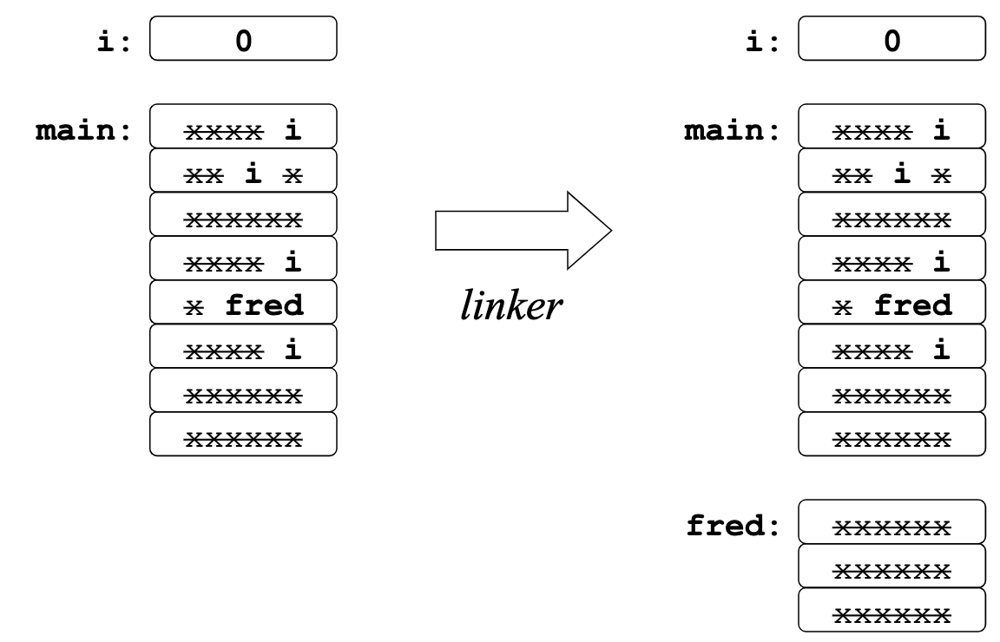{ width=30% }
* Loading
    * Executable file still has some names even through it is mostly machine language,
        the final step is now when the program is run, the loader loads it into memory
        and replaces names with addresses
    * Loader finds an address for every piece and replaces names with addresses
* Running
    * After loading, the program is entirely in machine language, where all names have
        been replaced with memory addresses

    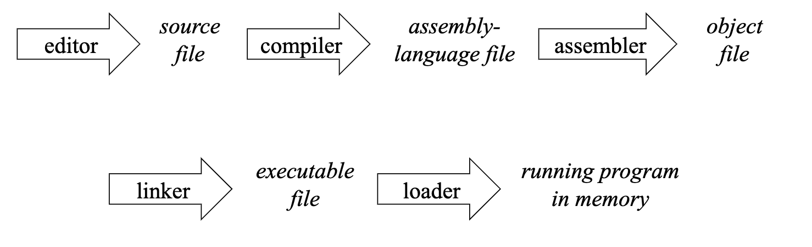{ width=50% }

* Optimization
    * Code generated by a compiler is usually optimized to make it faster, smaller, or both
    * Other optimizations may be done by the assembler, linker, and/or loader
    * Compilers can remove variables, remove code, add code, move code around, etc.
* Variation: Interpreters
    * To interpret a program is to carry out the steps it specifies, without first
        translating into a lower-level language
    * Interpreted languages like python are usually much slower, since compiling takes
        time up front, but fast at runtime
* Virtual Machines
    * A language system can produce code in a machine language for which there is no
        hardware: an intermediate code
    * Language system may do the whole classical sequence, but then interpret the
        resulting intermediate-code program
    * This allows for cross platform execution and heightened security
* Delayed linking
    * Delay linking step
    * Code for library functions is not included in the executable file of the calling program
    * In windows functions for delayed linking are stored in .dll files
        * Load-time dynamic linking - Loader finds .dll files and links the program to
            functions it needs, just before running
        * Run-time linking - Running program makes explicit system calls to find .dll files
            and load specific functions
    * In Unix, Libraries of functions for delayed linking are stored in .so files: shared
        object
        * Shared libraries - Loader links the program to functions it needs before running
        * Dynamically loaded libraries - Running program makes explicit system calls to
            find library files and load specific functions
    * In Java, the JVM automatically loads and links classes when a program uses them
    * The Advantages of Delayed Linking
        * Multiple programs can share one copy of library functions
        * Library functions can be updated independently of programs
        * Can avoid loading unused code
* Profiling
    * The classical sequence runs twice
    * First run of the program collects statistics: parts most frequently executed
    * Second compilation uses this information to help generate better code
* Dynamic Compilation
    * Some compiling takes place after the program starts running
    * Many variation like compile each function only when called, or roughly compile then
        spend more time on frequently used pieces of code
* Binding
    * Binding means associating two things—especially, associating some property with an
        identifier from the program
    * Ex: What set of values is associated with int?
    * Different bindings take place at different times
    * Language Definition Time
        * Some properties are bound when the language is defined like meanings of
            keywords like `void`
    * Language Implementation Time
        * Some properties are bound when the language system is written
        * Range of values of type int in C or implementation limitations like max
            identifier, max number of array dimensions
    * Compile Time
        * Some properties are bound when the program is compiled or prepared for
            interpretation
        * Types of variables, in languages like C and ML that use static typing
        * Declaration that goes with a given use of a variable, in languages that use
            static scoping
    * Link Time
        * Some properties are bound when separately-compiled program parts are combined
            into one executable file by the linker
        * Object code for external function names
    * Load Time
        * Some properties are bound when the program is loaded into the computer’s
            memory, but before it runs
        * Memory locations for code for functions and static variables
    * Run Time
        * Some properties are bound only when the code in question is executed:
        * Values of variables or types of variables in languages like lisp
* Runtime Support
    * Additional code the linker includes even if the program does not refer to it
        explicitly
    * Includes things like Exception handling, memory management, allocating memory, and
        an OS interface

### Chapter 5 - A First Look at ML

* Left Associative precesdence is  `{+,-} < {*,/,div,mod} < {~}`.
* String concatination: ^ operator
* Ordering comparisons: `<, >, <=, >=`, apply to string, char, int and real
* Boolean operators: andalso, orelse, not.

    ```ocaml
    - true orelse 1 div 0 = 0;
    val it = true : bool
    ```
* andalso and orelse are short-circuiting operators: if the first operand of orelse is true,
    the second is not evaluated and likewise for andalso

* Function Associativity is left-associative, so So `f a b` means `(f a) b`
* Tuples
    * ML gives the type of a tuple using * as a type constructor
    * For example, int * bool is the type of pairs (x,y) where x is an int and y is a
        bool
* Lists
    * All elements of the list must be of the same type
    * The @ operator concatenates lists
    * The :: operator is right-associative
    * The explode function converts a string to a list of characters, and the implode
        function does the reverse
* Functions
    * Function Definition syntax:

        ```grammar
        <fun-def> ::=  fun <function-name><parameter> = <expression> ;
        ```
    * ML gives the type of functions using -> as a type constructor
    * All ML functions take exactly one parameter To pass more than one thing, you can pass
        a tuple
* Combining Constructors
    * When combining constructors, list has higher precedence than *, and -> has lower
        precedence
    * Here is an example:

    ```ocaml
    (* These two are the same *)
    - int * bool list
    - int * (bool list)

    (* These two are the same *)
    - int * bool list -> real
    - (int * (bool list)) -> real
    ```
### Chapter 6 - Types

* A type is a set of values plus a low-level representation plus a collection of
    operations that can be applied to those values
* Primitive vs Contructed Types
    * Any type that a program can use but cannot define for itself is a primitive
        type in the language
    * Some primitive types in ML: `int, real, char`
* Primitive Types
    * Some languages define the primitive types more strictly than others
    * Java for example defines them exactly, whereas languages like C and ML leave a
        little wiggle room
* Constructed Types
    * Additional types defined using the language, like uples, arrays, strings, lists,
        unions, subtypes, and function types
    * Enum types are supported by many languages, where you can explicitly state all the
        different potential values
    * A common representation is to treat the values of an enumeration as small integers
    * Can also make sets by tupling and combining two different types of values
    * C lets you do this with structs while ML and other languages have explicit tuples
    * Many languages also support union types like in C:

        ```c
        union element {
            int i;
            float f;
        };
        ```
    * Or like in ML:

        ```ocaml
        datatype element =
            I of int |
            F of real;
        ```
* Strictly Typed Unions
    * In ML all you can do with a union is extract the contents and state what to do with
        each type of value in the union
* Making Subtypes
    * Some Languages support subtypes with more or less generality
    * Example of Lisp Types with predicates

        ```lisp
        (declare (type integer x))
        (declare (type (or null cons) x))
        (declare (type (and number (not integer)) x))
        (declare (type (and integer (satisfies evenp)) x))
        ```
* Representing Subtype Values
    * Usually, we just use the same representation for the subtype as for the supertype
* Operations on Subtype Values
    * Usually, supports all the same operations that are supported on the supertype
    * And perhaps additional operations that would not make sense on the supertype:
      like `function toDigit(X: Digit): Char`;
    * A subtype is a subset of values, but it can support a superset of operations.
* Classes
    * In class-based object-oriented languages, a class can be a type: data and operations
        on that data, bundled together
* Functions
    * Most languages have some notion of function types, what is the domain and codomain?
* Operations on Functions
    * We have taken it for granted that other types of values could be passed as
        parameters, bound to variables, and so on
    * Not all languages let you pass in functions as parameters
* Type Annotations
    * Many languages require, or at least allow, type annotations on variables, functions
    * This is used to let the prgrammer specify static type information
* Extreme Type Inference
    * ML takes type inference to extremes - infers a static type for every expression and
        for every function, without annotations
* Simple Type Inference
    * Most languages require some simple kinds of type inference
    * Expressions may have static types, inferred from operators and types of operands
* Static Type Checking
    * Static type checking determines a type for everything before running the program:
        variables, functions, expressions, everything
    * Most modern languages are statically typed
* Dynamic Typing
    * In some languages, programs are not statically type-checked before being run
    * They are still dynamically type checked at runtime, the language system checks
        that operands are of suitable types for operators
    * Although dynamic typing does not type everything at compile time, it still uses
        types, even moreso than static languages, since it must store type information
        along with values in memory
* Static And Dynamic Typing
    * Statically typed languages often use some dynamic typing
    * Everything is typed at compile time, but compile-time type may have subtypes
    * At runtime, it may be necessary to check a value’s membership in a subtype
* Type Equivalence
    * An important question for static and dynamic type checking is when types are the
        same?
    * Name equivalence: types are the same if and only if they have the same name
    * Structural equivalence: types are the same if and only if they are built from the
        same primitive types using the same type constructors in the same order
    * ML uses more structural equivalence, PASCAL more name equivalence

### Chapter 7 - A Second Look at ML

* Constants as Patterns
    * Underscore can be used as a pattern, it matches anything, but doesn't bind a
        variable
    * Can explicitly list the values you want to match, but if you don't cover everything
        you will get a non-exhaustive warning at runtime
* Local Variable Definitions
    * When you use val at the top level to define a variable, it is visible from that point
        forward
    * There is a way to restrict the scope of definitions: the let expression
        `<let-exp> ::= let <definitions> in <expression> end`
    * Here, the variable is only allowed to be used within the `in <expression>`
* Example: Merge Sort
    * The halve function divides a list into two nearly-equal parts of a tuple

        ```ocaml
        fun halve nil = (nil, nil)
        |   halve [a] = ([a], nil)
        |   halve (a::b::cs) =
                let
                    val (x, y) = halve cs
                in
                    (a::x, b::y)
                end;
        ```
    * Merge merges two sorted lists

        ```ocaml
        fun merge (nil, ys) = ys
        |   merge (xs, nil) = xs
        |   merge (x::xs, y::ys) =
                if (x < y) then x :: merge(xs, y::ys)
                else y :: merge(x::xs, ys);
        ```
    * And now the full merge sort:

        ```ocaml
        fun mergeSort nil = nil
        |   mergeSort [a] = [a]
        |   mergeSort theList =
                let
                    val (x, y) = halve theList
                in
                    merge(mergeSort x, mergeSort y)
                end;
        ```

### Chapter 8 - Polymorphism

* Functions with the flexibility to take in many different types are known as
    polymorphic, and this takes on many forms
* Overloading
    * An overloaded function name or operator is one that has at least two definitions,
        all of different types
    * Many languages have overloaded operators, while some even let you define your own,
        like C++
    * C++ lets virtually all operators to be overloaded including:
        ```
        +,-,*,/,%,^,&,|,~,!,=,<,>, +=,-=,=,*=,/=,%=,^=,&=,|=,
<<,>>,>>=,<<=,==, !=,<=,>=,&&,||,++,--,->*,,
        ```

    * Compilers usually implement overloading in the same way:
        * Create a set of monomorphic functions, one for each definition
        * Invent a mangled name for each, encoding the type information
        * Have each reference use the appropriate mangled name, depending on the
            parameter types
* Coercion
    * A coercion is an implicit type conversion, supplied automatically even if the
        programmer leaves it out
    * An example in Java would be:

        ```java
        double x;
        x = 3; // Casts 3 to double
        ```
* Parameter Coercion
    * When a language supports coercion of parameters on a function call, the
        resulting function (or operator) is polymorphic

        ```java
        void f(double x) {
            ...
        }
        // This f can be called with any type of parameter Java is willing to coerce to
        // type double

        f((byte) 1);
        f((short) 2);
        f('a');
        f(3);
        f(4L);
        f(5.6F);
        ```
* Defining Coercions
    * Languages usually have pages defining valid coercions, through languages like ML
        have none
    * This can get tricky however with complex function definitions
* Parametric Polymorphism
    * A function exhibits parametric polymorphism if it has a type that contains one or
        more type variables
    * A type with type variables is a polytype
    * In C++:

        ```cpp
        template<class X>
        X max(X a, X b) {   return a>b ? a : b; }
        ```
    * In ML:

        ```ocaml
        - fun identity x = x;
        val identity = fn : 'a -> 'a
        - identity 3;
        val it = 3 : int
        - identity "hello";
        val it = "hello" : string
        - fun reverse x =
        =   if null x then nil
        =   else (reverse (tl x)) @ [(hd x)];
        val reverse = fn : 'a list -> 'a list
        ```
* Subtype Polymorphism
    * A function or operator exhibits subtype polymorphism if one or more of its
        parameter types have subtypes

### Chapter 9 - A Third Look at ML

* Case expressions
    * The syntax for case expressions: `<case-expr> ::= case <expression> of <match>`
    * So in ml:

        ```ocaml
        - case 1+1 of
        =    3 => "three" |
        =    2 => "two" |
        =    _ => "hmm";
        ```
* Anonymous Functions
    * Functions in ML don't have names, rather you assign them to variables that do

        ```ocaml
        (* Named function: *)
        - fun f x = x + 2;
        val f = fn : int -> int

        (* Anonymous function: *)
        - fn x => x + 2;
        val it = fn : int -> int
        ```
* Higher-order functions
    * Every function has an order
    * A function that does not take any functions as parameters, and does not return
        a function value, has order 1
    * A function that takes in a function or returns a function has order n+1, where n is
        the highest-order parameter/returned val
* Currying
    * Functions in ML take one parameter, then for functions of multiple parameters, they
        are curried so a function that takes in two ints actually is a function that
        takes in an int and then that gives a function that takes in another int
    * Advantages is no tuples, and we get to specialize functions for particular initial
        parameters

### Chapter 10 - Scope

* Definitions
    * When there are different variables with the same name, there are different possible
        bindings for that name
    * A definition is anything that establishes a possible binding for a name
* Scope
    * There may be more than one definition for a given name
    * An occurrence of a name is in the scope of a given definition of that name whenever
        that definition governs the binding for that occurrence
* Blocks
    * A block is any language construct that contains definitions, and also contains the
        region of the program where those definitions apply

    ```ocaml
    let
        val
        val
    in
        x+y
    end
    ```
* Different ML Blocks
    * The `let` is just a block: no other purpose
    * A `fun` definition includes a block
    * All the matching alternatives are their own block
* Java Blocks
    * In Java and other C-like languages, you can combine statements into one compound
        statement using { and }
    * A compound statement also serves as a block
* Classic Block Scope Rule
    * he scope of a definition is the block containing that definition, minus the scopes
        of any redefinitions of the same name in interior blocks
    * Most statically scoped, block-structured languages use this or some minor variation
* Labeled Namespaces
    * A labeled namespace is any language construct that contains definitions and a
        region of the program where those definitions apply
* ML Structure
    * A little like a block: a can be used anywhere from definition to the end

        ```ocaml
        structure Fred = struct
            val a = 1;
            fun f x = x + a;
        end;
        ```
* Namespace Advantages
    * Allow for simple definitions like `max` to be available multiple times in different
        namespaces
    * Can avoid name conflicts
* Dynamic Scoping
    * Each function has an environment of definitions
    * If a name that occurs in a function is not found in its environment, its caller’s
        environment is searched
    * And if not found there, the search continues back through the chain of callers
* Static Vs. Dynamic
    * The scope rules are similar
    * Both have scope holes - places where a scope does not reach because of
        redefinition
    * static rule talks only about regions of program text, so it can be applied at
        compile time
    * The dynamic rule talks about runtime events
* Seperate Compilation
    * Parts are compiled separately, then linked together
    * Scope issues extend to the linker: it needs to connect references to definitions
        cross separate compilations
* C Approach - Compiler Side
    * Two different kinds of definitions:
        * Full definition
        * Name and type only: a declaration in C-talk
* C Approach, Linker Side
    * When the linker runs, it treats a declarationas a reference to a name defined in
        some other file
    * It expects to see exactly one full definition of that name

### Chapter 11 - A Fourth Look At ML

* Type Definitions
    * Predefined, but not primitive in ML:

        ```ocaml
        datatype bool = true | false;
        ```
    * Type constructor for lists:

        ```ocaml
        datatype 'element list = nil |
            :: of 'element * 'element list
        ```
* Wrappers
    * You can add a parameter of any type to a data constructor, using the keyword `of`

        ```ocaml
        datatype exint = Value of int | PlusInf | MinusInf;
        ```
    * In effect, such a constructor is a wrapper that contains a data item of the given
        type
    * `Value` is a data constructor that takes a parameter: the value of the int to store
    * It looks like a function that takes an `int` and returns an `exint` containing that `int`
* To recover a data constructor’s parameters, use pattern matching

    ```ocaml
    - val (Value y) = x;
    val y = 5 : int
    ```
* Type Constructors With Parameters
    * Type constructors can also use parameters:

        ```ocaml
        datatype 'a option = NONE | SOME of 'a;
        ```
    * Type constuctor parameter comes before the type constructor name
    * We have types `'a option` and `'a list'`
* Uses For option
    * Used by predefined functions when the result is not always defined

        ```ocaml
        - fun optdiv a b =
        =   if b = 0 then NONE else SOME (a div b);
        val optdiv = fn : int -> int -> int option
        ```

### Chapter 12 - Memory Locations For Variables

* A Binding Question
    * Variables are bound (dynamically) to values
    * How are variables bound to memory locations?
* Function Activations
    * Activation of a function: the lifetime from execution to return
    * Activation-specific variable: each activation has its own binding of a variable to
        a memory location
* Activation Specific variables
    * In most modern languages, activation-specific variables are the most common kind

        ```ocaml
        fun days2ms days =
            let
                val hours = days * 24.0
                val minutes = hours * 60.0
                val seconds = minutes * 60.0
            in
                seconds * 1000.0   end;
        ```
* Most imperative languages have a way to declare a variable that is bound to a single
    memory location for the entire runtime
* Object-oriented languages use variables whose lifetimes are associated with object
    lifetimes
* Scope And Lifetime Differ
    * In most modern languages, variables with local scope have activation-specific
        lifetimes,
* Block Activation Records
    * When a block is entered, space must be found for the local variables of that
        block
    * Can do this by either preallocating the containing function's activation record,
        extend the functions activation record, or allocate seperate block activation
        records
* Static Allocation
    * The simplest approach is to allocate one activation record for every function
        statically
    * This is simple and fast and used by old languages like Cobol and Fortran
    * However, each function only gets one record and can only have on activation alive
        at a time, which is broken for recursion or multithreading
* Stacks Of Activation Records
    * To support recursion: need new activation record for each activation
    * Dynamic allocation: activation record allocated when function is called
* Current Activation Record
    * Location of current activation record is not known until runtime
    * A function must know how to find the address of its current activation record
* Nesting Functions
    * Function definitions can be nested inside other function definitions like in ML,
        Python, Pascal, etc
    * An inner function needs to be able to find the address of the most recent
        activation for the outer function
* Functions As Parameters
    * What happens when you pass in a function as a parameter?
    * Functional languages allow many more kinds of operations on function-values
    * Function-values include both parts: code to call, and nesting link to use when
        calling it

### Chapter 13 - A First Look At Java

* Java Terminology
    * Each point is an object
    * Each includes three fields
    * Each has three methods
    * Each is an instance of the same class
* Constructed Types
    * Constructed types are all reference types: they are references to objects
    * Includes any class, interface, or array type
* Strings
    * Predefined but not primitive: a class `String`
    * The + operator has special overloading and coercion behavior for the class String
* Operators With Side Effects
    * An operator has a side effect if it changes something in the program environment,
        like the value of a variable or array element
    * Assignment is an important part of what makes a language imperative
* Rvalues and Lvalues
    * Why does a=1 make sense, but not 1=a?
    * Expressions on the right must have a value, while expressions on the left must have
        a memory location
    * In most languages, the context decides whether the language will use the rvalue or
        the lvalue of an expression
    * Side-effecting expressions have both a value and a side effect
    * Value of `x=y` is the value of `y`; side-effect is to change `x` to have that value
* Class Method Calls
    * Class methods define things the class itself knows how to do, not objects of the
        class
* Method Call Syntax:
    * Normal instance method call

        ```
        <method-call> ::= <reference-expression>.<method-name> (<parameter-list>)
        ```
    * Normal class method call

        ```
        <method-call> ::= <class-name>.<method-name> (<parameter-list>)
        ```
    * Either kind, from within another method of the same class

        ```
        <method-call> ::= <method-name>(<parameter-list>)
        ```
* Object Creation Expressions
    * Objects are created with `new`
    * Objects are never explicitly destroyed, rather Java's garbage collection does that
* General Operator Info
    * All left-associative, except for assignments
    * 15 precedence levels, use parentheses
* References
    * A reference is a value that uniquely identifies a particular object

        ```java
        public IntList(ConsCell s) {
            start = s;
        }
        ```
    * What gets passed to the IntList constructor is not an object — it is a reference to
        an object
    * Objects in Java are effectively pointers
    * Java variable cannot hold an object, only a reference to an object


### Chapter 14 - Dynamic Memory Allocation

* Lots of things like objects and activation records require memory at runtime
* Language systems provide a runtime hidden memory management
* Declaring An Array
    * A Java array declaration:

        ```java
        int[] = null
        ```
    * Array types are reference types - an array is really an object
    * Right now, we essentially declared an integer pointer, which can point to an int
        array
* Creating an Array:

    ```java
    int[] a = new int[100];
    ```
* Stack of activation Records
    * For almost all languages, activation records must be allocated dynamically
    * These are statically allocated variables, that are pushed onto the stack and then
        freed after they are done
    * For the stack, the order of variables must be constant and known, what happens if
        allocations and deallocations happen out of order
* The Heap Problem and First Fit
    * A heap is a pool of blocks of memory, with an interface for unordered runtime
        memory allocation and deallocation
    * First fit is a linked list of free blocks, to allocate, can just search free list
        for first adequate block, and allocate however much memory is needed, returning
        the rest to the rest of the heap
* Quick Lists
    * Small blocks tend to be allocated and deallocated much more frequently, so a common
        optimization is to keep separate free lists for popular block sizes, so here
        blocks are one constant size
* Fragmentation
    * Note the heap may have a problem of fragmentation where there are a lot of
        small unused pieces of memory.
* Current Heap Links
    * A current heap link is a memory location where a value is stored that the running
        program will use as a heap address
* Heap Compaction
    * Manager can move allocated blocks to new locations and update all links on that
        block
    * So it can get rid of fragmentation by moving all the allocated blocks to one end
* Garbage Collection Approaches
    * **Mark and Sweep**
        * Uses current heap links in a 2 stage process
        * Mark - find the live link heaps and mark all the heap blocks linked to them
        * Sweep - make a pass over the heap and return unmarked blocks to the free pool
    * **Copying**
        * A copying collector divides memory in half, and uses only one half at a time
        * When one half becomes full, find live heap links, and copy live blocks to the
            other half
    * **Reference Counting**
        * Each block has a counter of heap links to it
        * When counter goes to zero, block is garbage and can be freed
        * Has a problem with cycles of garbage, and in general performance since the
            overhead is high
* Garbage collection
    * Generational Collection
        * Have generational counters that divide blocks according to age
        * Garbage collect in the younger generations more often
    * Incremental Collection
        * Collect garbage a little at a time
        * Avoid having spikes in overhead caused by the mark and sweep operations


### Chapter 15 - A Second Look at Java

* Interfaces
    * A method prototype just gives the method name and type—no method body
    * An interface is just a collection of method prototypes

        ```java
        public interface Drawable {
            void show(int xPos, int yPos);
            void hide();
        }
        ```
* Implementing Interfaces
    * A class can declare that it implements a particular interface
    * Then it must have public functions that match the interface
* Benefits of an Interface
    * Interface can be implemented by many classes
    * Interface leads to use of polymorphism
* Polymorphism
    * One class can be derived from another, using the keyword `extends`
    * Classes that are derived inherit all the parent methods and fields
* Inheritance Chains
    * All classes but one are derived from some class
    * If you do not give an `extends` clause, Java supplies one: `extends` Object
    * Object is the root class
* The Object Class
    * All classes inherit methods from object like:
        * toString, for converting to a String
        * equals, for comparing with other objects
        * hashcode, for computing an int hash code
* Extending And Implementing
    * Classes can use `extends` and `implements` togethe
    * For every class, Java keeps track of what interfaces it implements, the methods it
        has to define, the methods defined for it, and the fields defined for it
    * An `implements` affects the first two, but an `extends` affects all four of those
        options
* Abstract Classes
    * Classes can get out of implementing all their methods by making them abstract
        classes
    * An abstract class is used only as a base class, no objects for that class will be
        created
* Collision Problem and Diamond Problem
    * When you have multiple classes you inherit from, might have conflicts when two
        parent classes have a method with the same name
    * A language that supports multiple inheritance must have mechanisms for handling
        these problems
    * Java designers that this additional power was not worth the language complexity
* Generics
    * Weakensses are no compile-type type checking on element types and primitives must
        be stored in their corresponding object type first, so `int` would actually be
        `Integer`
    * You can now use generics with the distinct angle bracket notation

        ```java
        interface Worklist<T> {
            void add(T item); booleanhasMore();
            T remove();
        }

        Worklist<String> w;
        ...
        w.add("Hello");
        String s = w.remove();
        ```
* Using Generic Classes

    ```java
    Stack<String> s1 = new Stack<String>();
    Stack<Integer> s2 = new Stack<Integer>();
    s1.add("hello");
    String s = s1.remove();
    s2.add(1);
    inti = s2.remove();
    ```
    * Notice the coercions: `int` to `Integer`

### Chapter 19 - A First Look At Prolog

* Terms
    * Everything in Prolog is built from terms
    * There are three kinds of terms: Constants: integers, real numbers, atoms,
        Variables, and Compound terms
* Constants
    * Integer and real constants: 1 vs 1.23
    * Atoms: A lowercase letter followed by any number of additional letters, digits or
        underscores, a sequence of non-alphanumeric characters plus a few special atoms:
        like []
* Atoms Are Not Variables
    * An atom can look like an ML or Java variable
    * Atoms are more like string constants
* Variables
    * Most of the variables you write will start with an uppercase letter
    * Those starting with an underscore, including \_, get special treatment
* Compound Terms
    * An atom followed by a parenthesized comma-seperated list of items

        ```Prolog
        x(y,z), +(1,2), .(1,[]),
        ```
    * Think of them as structured data
* Terms
    * All Prolog programs are built on terms

        ```
        <term> ::= <constant>|<variable> |<compound-term>
        <constant> ::= <integer> |<real number> | <atom>
        <compound-term> ::= <atom> ( <termlist> )
        <termlist> ::= <term>|<term> , <termlist>
        ```
* Unification
    * Two terms unify if there is some way of binding their variables that makes them
        identical
    * For instance, `parent(adam,Child)` and `parent(adam,seth)` unify by binding the variable
        `Child` to the atom `seth`
* The Prolog Database
    * A Prolog language system maintains a collection of facts and rules of inference
    * A Prolog program is just a set of data for this database, organized by facts
    * An example of a Prolog program is

        ```Prolog
        parent(kim,holly).
        parent(margaret,kim).
        parent(margaret,kent).
        parent(esther,margaret).
        parent(herbert,margaret).
        parent(herbert,jean).
        ```
* The `consult` Predicate
    * Predefined predicate to read a program from a file into the database
* Queries
    * A query asks the language system to prove something, return true or false
    * Some queries (like `consult`) are only executed for the side effects
* Conjunctions
    * A conjunctive query has a list of query terms separated by commas

        ```Prolog
        ?- parent(margaret,X), parent(X,holly).
        X = kim .
        ```
    * The Prolog system tries prove them all
* The Need For Rules
    * A rule says how to prove something: to prove the head, prove the conditions

        ```Prolog
        greatgrandparent(GGP,GGC) :-
        parent(GGP,GP),
        parent(GP,P),
        parent(P,GGC).
        ```
    * To prove `greatgrandparent(GGP,GGC)`, find some `GP` and `P` for which you can
        prove `parent(GGP, GP)`, them `parent(GP, P)`, and then finally `parent(P, GGC)`
* A Program With The Rule

    ```Prolog
    parent(kim,holly).
    parent(margaret,kim).
    parent(margaret,kent).
    parent(esther,margaret).
    parent(herbert,margaret).
    parent(herbert,jean).
    greatgrandparent(GGP,GGC) :-
        parent(GGP,GP), parent(GP,P), parent(P,GGC).
    ```
    * A program consists of a list of clauses
    * A clause is either a fact or a rule, and ends with a period
* Recursive Rules

    ```Prolog
    ancestor(X,Y) :- parent(X,Y).
    ancestor(X,Y) :-
    parent(Z,Y),
    ancestor(X,Z).
    ```
    * X is an ancestor of Y if:
        * Base case: X is a parent of Y
        * Recursive case: there is some Z such that Z is a parent of Y, and X is an
            ancestor of Z
* Core Prolog Syntax
    * The core syntax of Prolog can be boiled down to

        ```Prolog
        <clause> ::=  <fact> |<rule>
        <fact> ::=  <term> .
        <rule> ::=  <term> :- <termlist> .
        <termlist> ::=  <term>|<term> , <termlist>
        ```
* The Procedural Side
    * A Prolog program specifies proof procedures for queries
* The Declarative Side
    * A rule is a logical assertion
    * Just a formula – it doesn’t say how to doanything – it just makes an assertion
* Declarative Languages
    * Each piece of the program corresponds to a simple mathematical abstraction
    * Many view it as the opposite of imperative
* Operators
    * An operator is just a predicate for which a special abbreviated syntax is supported
* The `=` Predicate
    * The goal =(X,Y) succeeds if and only if X and Y can be unified

        ```Prolog
        ?- parent(adam,seth)=parent(adam,X).
        X = seth.
        ```
* Arithmetic Operators
    * Predicates +, -, * and / are operators too, with the usual precedence and
        associativity

        ```Prolog
        ?- X = +(1,*(2,3)).
        X = 1+2*3.

        ?- X = 1+2*3.
        X = 1+2*3.
        ```
* Not Evaluated
    * The term `+(1, *(2,3))` is not evaluated
    * There is a way to make Prolog evaluate such term
* Lists in Prolog
    * Similar to ML lists, the atom [] represents the empty list
    * A predicate . corresponds to ML’s :: operator

        | ML Expression    | Prolog Term       |
        | ---------------- |:-----------------:|
        | []               | []                |
        | 1::[]            | .(1,[])           |
        | 1::2::3::[]      | .(1,.(2,.(3,[]))) |
* The Anonymous Variable
    * The variable \_ is an anonymous variable
    * Every occurrence is bound independently of every other occurrence
    * Matches any term without introducing bindings

        ```Prolog
        tailof([_|A],A).
        ```
    * This `tailof(X,Y)` succeeds when X is a non-empty list and Y is the tail of that
        list
* The not Predicate
    * For simple applications, it often works quite a bit logical negation

        ```Prolog
        ?- member(1,[1,2,3]).
        true .

        ?- not(member(4,[1,2,3])).
        false.
        ```
    * To prove `not(X)`, Prolog attempts to prove `X`
    * `not(X)` succeeds if `X` fails

### Chapter 20 - A Second Look At Prolog

* Substitutions
    * A substitution is a function that maps variables to terms:
        $\sigma$ = {`X`$\rightarrow$`a`, `Y`$\rightarrow$`f(a,b)`}
    * This $\sigma$ maps `X` to `a` and `Y` to `f(a,b)`
    * The result of applying a substitution to a term is an instance of the term
    * $\sigma$(`g(X,Y)`) = `g(a,f(a,b))` so `g(a,f(a,b))` is an instance of `g(X,Y)`
* Unification
    * Terms $t_1$ and $t_2$ unify if there exists a $\sigma$ such that
        $\sigma(t_1)=\sigma(t_2)$
    * Examples:
        * `a` and `b` do not unify
        * `f(X,b)` and `f(a,Y)` unify: a unifier is `{X→a, Y→b}`
        * `f(X,b)` and `g(X,b)` do not unify
        * `a(X,X,b)` and `a(b,X,X)` unify: a unifier is `{X→b}`
        * `a(X,X,b)` and `a(c,X,X)` do not unify
        * `a(X,f)` and `a(X,f)` do unify: a unifier is `{}`
* Most General Unifier
    * Term $x_1$ is more general than $x_2$ if $x_2$ is an instance of $x_1$ but not
        vice-versa, so `parent(fred,Y)` is more general then `parent(fred,mary)`
    * The most general unifier $\sigma_1$ of two terms $t_1$ and $t_2$ if there doesn't
        exist a unifier $\sigma_2$ that is more general
* The Occurs Check
    * Any variable `X` and term `t` unify with `{X→t}`
        * `X` and `f(a,g(b,c))` unify: an MGU is `{X→f(a,g(b,c))}`
        * `X` and `f(a,Y)` unify: an MGU is `{X→f(a,Y)}`
    * Unless `X` occurs in `t`:
        * `X` and `f(a,X)` do not unify, in particular not by `{X→f(a,X)}`
* A Procedural View
    * Each clause is a procedure for proving goals
    * Take for example `p :- q, r.` - to prove a goal, first unify the goal with p,
        then prove q, then prove r
* Backtracking
    * Prolog explores all possible targets of each call, until it finds as many
        successes as the caller requires or runs out of possibilities
* Substitution

    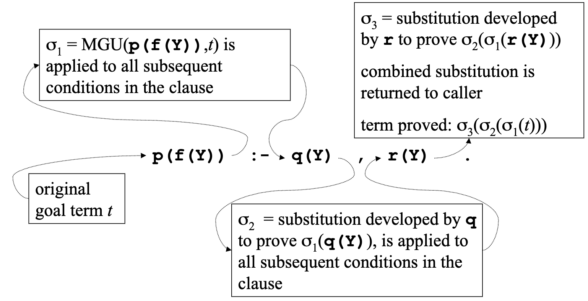{ width=40% }
* Proof Trees
    * Proof trees capture the order of traces of prove, without the code
    * Root is original query
    * Nodes are lists of goal terms, with one child for each clause in the program

    { width=30% }
    * Children of a node represent clauses, in the order they appear in the program
    * nothing nodes, which represent clauses that do not apply to the first goal in the
        list can be eliminated
    * So the final, simplified tree wil look like this:

    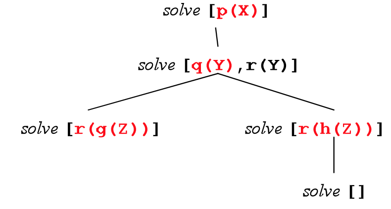{ width=30% }
* Prolog Semantics
    * A Prolog language system must act in the order given by a depth-first, left to
        right traversal of the proof tree
* Variable Renaming
    * To avoid capture, use fresh variable names for each clause
    * The first application of `reverse` might be

        ```Prolog
        reverse([Head1|Tail1],X1) :-
            reverse(Tail1,Y1),
            append(Y1,[Head1],X1).
        ```
    * The Next might be

        ```Prolog
        reverse([Head2|Tail2],X2) :-
            reverse(Tail2,Y2),
            append(Y2,[Head2],X2).
        ```
* Quoted Atoms As Strings
    * Any string of chars enclosed by quotes is a term and treated as an atom
    * This allows for I/O:

        ```Prolog
        ?- write('Hello world').
        Hello world
        true.

        ?- read(X).
        |: hello.
        X = hello.
        ```
* The Cut
    * Written !, pronounced “cut”, is a goal that always succeeds (like true), but when
        it succeeds, it eliminates some backtracking
    * If q1 through qj succeed, the cut does too and tells Prolog there's no going back,
        so there is no backtracking to look for other solutions for q1 through qj

        ```Prolog
        p :- q1, q2, ..., qj, !.
        ```
    * the first solution found for a given goal using this rule will be the last
        solution found for that goal

### Chapter 22 - A Third Look At Prolog

* Unevaluated Terms
    * Prolog operators allow terms to be written more concisely, but are not evaluated
    * These are all the same term:

        ```Prolog
        +(1,*(2,3))
        1+ *(2,3)
        +(1,2*3)
        (1+(2*3))
        1+2*3
        ```
* Evaluating Expressions
    * The `is` predicate can be used to evaluate a term that is a numeric expression
    * `is(X,Y)` evaluates the term `Y` and unifies `X` with the resulting atom
    * Predicates must be defined at the time of operation
    ```Prolog
    ?- Y is X+2, X=1.
    ERROR: is/2: Arguments are not sufficiently instantiated

    ?- X=1, Y is X+2.
    X = 1, Y = 3.
    ```
    * For `X is Y`, the predicates that appear in `Y` have to be evaluable
* Real Values and Integers
    * There are two numeric types: integer and real.
    * Most of the evaluable predicates are overloaded for all combinations.
    * Prolog is dynamically typed and types are resolved at runtime
* Comparisons
    * Numeric comparison operators: `<, >, =<, >=, =:=, =\=`
    * Prolog evaluates both sides and then compares numerically
* Equalities
    * There are 3 types of equality in Prolog
    * `X is Y` evaluates `Y` and unifies the result with `X`
        * `3 is 1+2` succeeds, but `1+2 is 3` fails
    * `X = Y` unifies `X` and `Y`, with no evaluation: both
    * `X =:= Y` evaluates both and compares
    * Here is any example of `mylength`

        ```Prolog
        mylength([],0).
        mylength([_|Tail], Len) :-
            mylength(Tail, TailLen),
            Len is TailLen + 1.

        ?-mylength([a,b,c],X).X 
        X = 3.
        ```
* The `findall` Predicate
    * `findall(X,Goal,L)` finds all ways of proving `Goal` and for each applies to `X`
        the same substitution that made a provable instance of Goal and unigies `L` with
        all those `X`s
