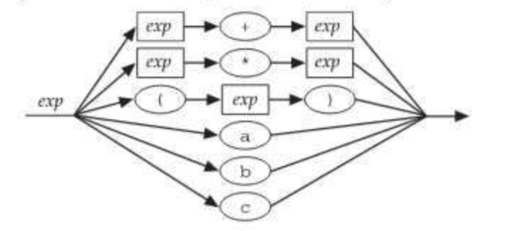

# CS 131 Reading 1 - 4/02/2019

### Chapter 1 - Programming Languages

1. There is a very large variety in programming languages
    * Imperative Languages: 
        * C for example is an imperative language

            ```c
            int fact (int n) {
                int sofar = 1;
                while (n > 0) sofar *= n-- return sofar;
                return sofar;
            }
            ```
        * Imperative languages have two main features: assignment and iteration
    * Functional Languages:
        * Funcional languages are based on two different hallmarks: 
        recursion and single-valued variables 
        * Here is an example in ml:

            ```ml
            fun fact x -
                if x <= a then 1 else x * fact (x ~ 1) ;
            ```
        * Another example in lisp:

            ```lisp
            (defun fact (x)
                (if (<= x 0) 1 (* x (fact (- x 1))))
            ```
    * Logic Programming Languages
        * Perhaps less natural then in functional programming languages, here is 
            fibonnacii with prolog

            ```prolog
            fact(X, 1) :- 
                X := 1,
                !.
            fact(X, Fact) :-
                X > 1,
                NewX is X - 
                fact(NewX, NF),
                Fact is X * NF.
            ```
        * The first three lines state that the factorial of X is 1 if X = 1
        * The Next five lines state:
            > "To prove that the factorial of X is Fact, you must do the following things; 
            prove that X is greater than one, prove that NewX is one less than X, 
            prove that the factorial of NewX is MF, and prove that Fact is X times NF."

        * Expressing a program in terms of rulesabout logical inference is the hallmark of logic 
        programming, which is perhaps not the greatest for mathematical expressions

    * Object-Oriented Languages
        * An example is Java, which is object oriented, which means that in addition to being 
        imperative, it also makes it easier to solve programming problems using objects.

            ```java
            public class MyInt { 
                private int value;
                public MyInt(int value) {
                    this.value = value;
                }
                public int getValue() {
                    return this.value;
                }
                public MyInt getFact() {
                    return new MyInt(fact(this.value));
                }
                private int fact(int n) {
                    int sofar = 1;
                    while (n > 1) sofar *= n--; 
                    return sofar;
                }
            }
            ```
2. Evolution Of Programming Languages
    * Programming Languages have evolved over time, through the use of dialects
        * FORTRAN for example has FORTRAN 77 and FOTRAN 2008 which are different dialects
    * Programming Languages evolve slowly with the help of different industries

### Chapter 2 - Defining Program Syntax

**Syntax**: 
The syntax of a programming language is the part of the language definition that 
says how programs look: their form and structure.

**Semantics**
The semantics of a programming language is the part of the language definition that says what 
programs do: their behavior and meaning.

* Grammar of modern programming languages has evolved to generally contain certain key elements
    * Example is word granularity, i.e. we do not have tokens be characters, we instead seperate 
        different syntactical structures with spaces and typically newlines
    * Some languages also have statement terminators (Ex: C has ';')
    * All languages support comments in the middle of the line 
    * Example of how grammars can be formally structured:

        1. \<subexp> ::= a | b | c | \<subexp> - \<subexp> 
        2. \<subexp> ::=  \<var> - \<subexp> | \<var>

            \<var> ::= a | b | a
        3. \<subexp> ::= \<subexp> - \<var> | \<var>

           \<var> ::= a | b | c

* Another way to represent language meta syntax is through syntax diagrams
    
    { width=51% }
    

### Chapter 3 - Where Syntax Meets Semantics
 
1. Operators
    * Almost all modern programming languages also include special syntax for frequently used 
        simple operations like addition, subtraction, multiplication, and division.
    * The inputs to an operator are called its operands
        * Unary Operators take one operand, while binary operators take 2
    * Most modern programming languages use infix operations, so for an arbitrary operator \*,
        operands a and b would be operated like so: a \* b
        * Example of a non-infix language is lisp, which has prefix operations 

2. Precedence
    * Different Linguages have different ideas about how to ocganize operators
        into precedence levels.  
        * C for example has 15 levels, while Pascal has 
    * The lack of proper precedence in a language can lead to very unintuitive responses compared
        to what humans would expect
    * C with its very complex precedence system tries to mimic human level intuition, but it is 
        still very beneficial to add parentheses

3. Abstract Syntax Trees
    * A grammar for a realistically large grammar will have multiple non-terminal symbols.
    * Language systems usually store an abbreviated version ot a parse tree called the abstract 
        syntax tree or AST 
    * Many language systems use an AST as an internal representation of a program,

### Chapter 5 - A First Look at ML

1. h

