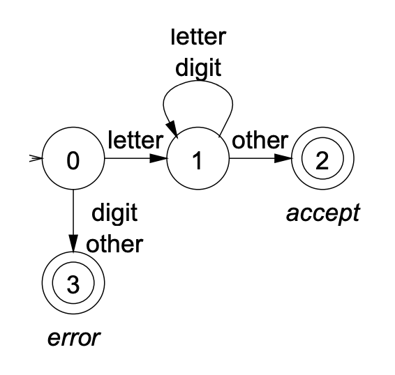

# Chapter 2 - Lexical Analysis

## Scanner


* Maps characters into tokens, which are the basic units of syntax
    * The code: `x = x + y` will be converted to `<id, x> = <id, x> + <id, y>`
* The character string value for a token is a lexeme
* Typical tokens include numbers, id, +, -, *, /, do, end
* Eliminates whitespace during this step

## Specifying Patterns

* A scanner must recognize various parts of the language's syntax
* For example, whitespace is easy to define:

    ```grammar
    <ws> ::= <ws> ' '
          |  <ws> '\t'
          |  ' '
          |  '\t
    ```
* A scanner must recognize various parts of the language’s syntax
* Regular expressions can be used to specify patterns for numbers/identifiers

## Recognizers

* Most programming language tokens can be described with REs We can use REs to
    build scanners automatically
* From a regular expression we can construct a deterministic finite automaton
* For example, suppose we have the following:

    ```grammar
    letter → (a | b | c | ... | z | A | B | C | ... | Z)
    digit → (0 | 1 | 2 | 3 | 4 | 5 | 6 | 7 | 8 | 9)
    id → letter ( letter | digit )
    ```

* The Recognizer for the identifier is:

{ width=30% }

* The recognizer can also be represented as a table:
* char_class:

|       | a-z    | A-Z    | 0-9   | other|
|:-----:|:------:|:------:|:-----:|:-----
| value | letter | letter | digit | other

* next_state:

| class  | 0 | 1 | 2 | 3 |
|:------:|:-:|:-:|:-:|:-:|
| letter | 1 | 1 | - | - |
| digit  | 1 | 1 | - | - |
| other  | 1 | 1 | - | - |

* To change languages, we can just change the tables

## Automatic Construction

* Scanner generators automatically construct code from regualr expression-like
    descriptions
    * Construct a DFA
    * Use State minimization techniques
    * Emit code for the scanner (table driven or direct code)
* `lex` is a scanner generator supplied with UNIX
    * Emits C code for scanner
    * Provides Macro Definitions for each token (used in the parser)
