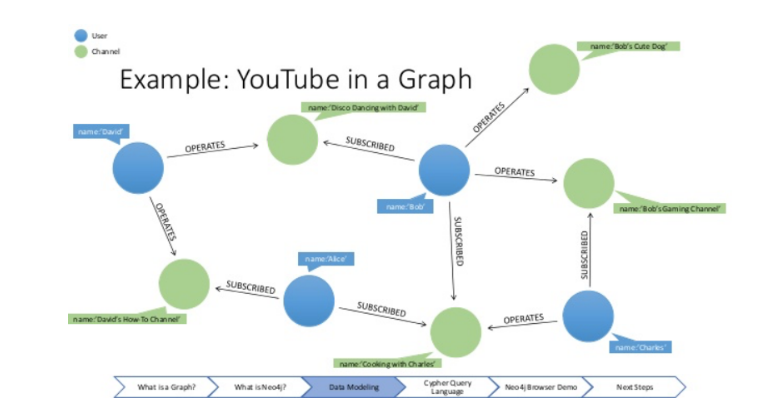
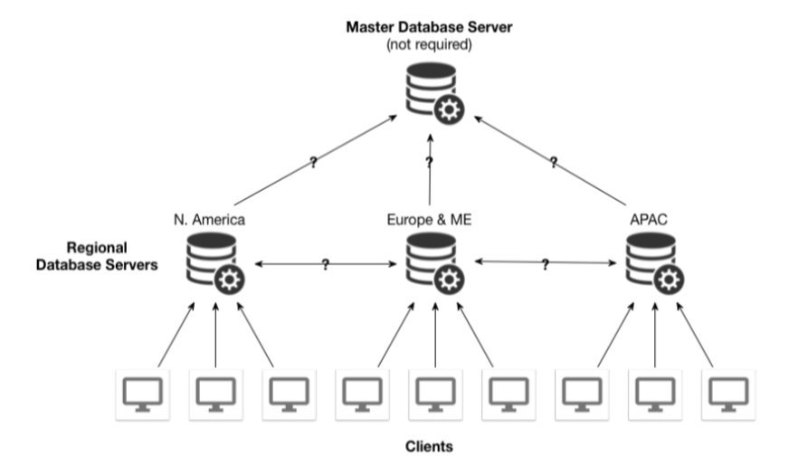
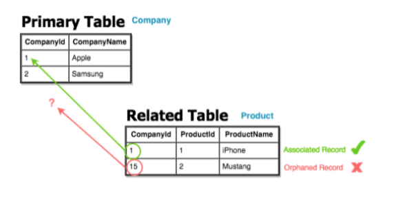

## Lecture 1 - Relational Algebra

**Dr. Ryan Rosario**

**Problems with Flat File System**

* Data Integrity and Redundancy 
    * Differing preferences formats 
    * Languages among sysadmins lead to possible data inconsistencies
    * Duplicate Data
* Sysadmin is the Bottleneck: all system changes, course changes restrictions must be 
    encoded in a custom application.
* Lack of Atomicity: system failures in the middle of a multi-step process
    can result in lost data. (i.e. bank transfer, exchanging classes). we should
    do it perfectly.
* Concurrent Access: It’s possible for data to get out of sync when
    multiple people read/write concurrently 
* Security: Without proper filesystem controls, flat files can be read by
anybody with access to the filesystem.

**Better Approach: Databases**

* A database abstracts away how the data is stored, maintained and
processed.
* Users don’t necessarily care how the data is laid out on disk.
* Big Data and distributed systems, such as Spark, have
reintroduced the importance of understanding how data is laid out
on disks/nodes
* Database Purposes
    * Provides a way to view, add, update and delete data without
        worrying about files and breaking data integrity.
    * Provides ONE single location for all data in the database 


**Examples of Databases that You Wouldn't Expect**

* Blockchain 
    * Blockchain is similar to a distributed database, with one major difference.
    * With blockchain, each participant maintains their own data and
        updates to the database. All nodes in the system cooperate to
        make sure the database comes to the same conclusion – a form of
        security.
    * Coindesk:
        >“Blockchains allow different parties that do not trust each other to
        share information without requiring a central administrator.
        Transactions are processed by a network of users acting as a
        consensus mechanism so that everyone is creating the same shared
        system of record simultaneously.”


* Git
    * Git can be used to track any kind of content, and it can be used to
        create a NoSQL database.
    * Git is basically a key-value store. 

**Levels of Abstraction**
1. Physical. How the data are stored.
    * MySQL has 9 storage engines, most importantly, MyISAMa
        and InnoDBb (speed, reads) and InnoDB (foreign keys and
        transactions).
    * PostgreSQL only has one.
2. Logical. 
    * Describes what data there are and the relationships
        among the data.
3. View. 
    * What the user sees. It is typically just a part of the
        database, such as used to generate a report. In the flat file
        case, the user relied on the sysadmin to “see” the data.

A database (more precisely a table or schema, which we will
discuss in a bit) is a way of abstracting a structured type, like
you’d see in C++.
```c
struct Section 
{ 
    int srs; // Unique ID number for this section
    int cap; // Max number of students allowed
    int instructor_uid; // Instructor's ID
    int parent_srs; // link to lecture
};
```

**Instances and Schema**

* The information stored in a database at a particular point in time
    is called an instance. This terminology has been resurrected by its
    use with Amazon Web Services.
* The overall design of a database is called a
schema.
    * The term schema is used interchangeably to describe the logical
    structure of a database or a relation (table).
* A subschema refers to the design of a particular part of the
    database, (often still called schema) if it refers to a DB
    or a table.

**Data Model**

The data model contains “conceptual” tools for describing data,
their relationships, semantics and consistency constraints.
Contains 5 major types:

1. **Relational**: Uses a collection of tables to represent data and
    their relationships. Each table has columns with unique names
    and a data type. Each column represents an attribute, and
    each row represents a record.
2. **Entity-Relationship (ER)**. Uses a collection of basic objects
    called entities and relationships among them. Typically used
    to visualize a database design.
3.**Object-Oriented**: Draws a strong analogy to object-oriented
programming with encapsulation, methods and object identity.
    * Data are essentially treated as instances of classes rather than
    tables.
4. **Document**: Individual data objects may have different sets of attributes.
    * Each data record mimics a flexible struct with no, or few, fixed
        fields.
    * Very different from the relational model, but many common
        semi-structured data types can be converted into the relational
        model.
    * JSON and XML are two examples of data types that are
        natural for the semi-structured model (Document Database).
5. **Network/Hierarchical/Graph**:
    * Actually pre-dates the relational model.
    * Defines data records as nodes, and relationships between
        records as edges.
    * Was considered unwieldy as they tied data very closely to
        database implementation details. This is still the case.
    * One notable NoSQL example is neo4j.

    { width=50% }
    
**Database Languages**

1. Data Definition Language (DDL)
    * A query is a written expression to retrieve or manipulate data.
    * A query language is simply the language it is written in. (Ex: SQL)
        * A SQL query takes takes one or a pair of relations and outputs a
            single relation as a result.
    * Note that JavaScript can be a query language!
    * **SQL**
        * Is not a procedural language.
        * There are computations that cannot be done in SQL, for example,
            sequential or iterative computations typically used in mathematical
            fields. Or algorithms that require the user to specify how to
            perform a computation.
        * In the case that SQL isn't enough, extract the data into your favorite language
            and then use that language to transform the data however you like, then insert back
2. Data Manipulation Language (DML)
    * Specifies a schema, a collection of attribute names and
        data types. It may also specify storage structure and access
        methods.
    * Constraints that can be specified
        1. **Domain Constraints**: restrict the values of a particular
            column to a particular type, or a particular set of values.
        2. **Referential Integrity**: There are many situations where a
            value in one relation must appear in some other relation for the data to
            be considered complete and valid. (Ex: Foriegn Keys)
        3. **Assertions**: Both a and b are types of assertions, but there
            are several other constraints we can impose. In the student
            records case, we can impose some example constraints that are
            checked by the DBMS on each attempted data manipulation:
        4. **Authorization**: Can restrict access to databases and
            schemas as well as particular operations on these databases
            and schemas. We can apply these rules to users, groups, etc.

**Data Storage and Querying**

* Databases have a storage manager that abstracts how the data is laid out on disk.
* Most of the data cannot fit in RAM, and must be read in from disk. This must be done
    eficiently because reading from the disk is very slow.
* The Storage Manager has the following duties
    1. **Authorization and data integrity checks** to prevent unauthorized access and 
        enforce integrity constraints.
    2. **Transaction management** ensures the database remains in a
        consistent state despite a system failure, and that concurrent
        accesses are handled appropriately. A transaction is a series of
        operations that must be executed as a logical unit, in a
        particular order.
    3. **File manager** allocates and manages disk space.
    4. **Buffer manager** deals with swapping data from disk to RAM
        and back.
* The storage manager uses a few of its own data structures
    1. Data files which store the... well... data.
    2. Data dictionary containing metadata about the structure and schema of the database.
    3. Indices that enable optimized and eficient lookup of data.
* Another element is a query manager.
    * When a query is executed the DML (i.e. SQL) statements are
        organized into a query plan that consists of low-level instructions
        that the query evaluation engine understands 


Note on Duplicate Data: Duplicate data should of course try to be avoided, this can be done 
through the process of deduplicating, called normalization


**Distributed Architecture**


* In a distributed architecture, there are several database servers.
    They may all contain identical data (replicated) or different parts
    of the data (sharded) that depend on geography or some other circumstance.

    { width=50% }

* Replicated or Sharded?
    1. You are developing a new social network to replace Facebook.
        It will allow people to create profiles and share content on a
        newsfeed across the entire (connected) world.
    2. You are the system administrator for UCLA and are
        responsible not only for student records, but also healthcare
        records at a variety of hospitals and medical centers in
        Southern California.
    3. You are creating a new blogging system that protects user
        privacy by relying on the user’s own system to host their
        content.


**Relational Model**

* A relational database consists of a collection of relations (often
    called tables).
* Each relation consists of records and attributes:
* Each row is a record, with a set of attributes that are related to
    that record.
* Each column represents a particular attribute, has a unique name,
    and a particular data type. (Columns are also referred to as n-tuples)
* Each attribute has a domain, a set of legal values. This domain
    can be discrete or continuous.
* An attribute can have a null value meaning it is unknown or does
    not exist.


**SuperKey**

A **superkey** is a set of one or more attributes that uniquely
identifies a tuple and distinguishes it from all other tuples.

Illustration: Suppose we use the sequential comment id version of
the youtube comment relation where the superkey K is video id
and comment id.

1. I can also include other attributes and it is a valid superkey,
    but it contains redundant information because video id and
    comment id are the only attributes we need to uniquely
    identify a tuple.
2. Suppose we drop video id from K. comment id is a proper
    subset of K, but it is not a superkey because each video with
    at least one comment will have a duplicated comment id.

Thus, you can prove that comment id and video id are a
composite superkey.


**Primary Key**

* Since a superkey uniquely identifies a tuple in a relation, no two
    tuples may same the same values for all of the attributes in K. A
    superkey that is minimal is also called a candidate key.
* A candidate key chosen by the database designer is more
    commonly called a primary key. 
* A primary key MUST be unique, and MUST be `NOT NULL`. For
    composite primary keys, all components of the primary key must
    be `NOT NULL`.


**Foriegn Key**

* For a particular relation R, a foreign key is an attribute of R that
    is the primary key of some other relation R'
* A foreign key is an attribute that can be used to
    tie together the tuples of two relations together into one. A foreign
    key in R does not uniquely identify a tuple in R, but does in the
    referred relation R'.
* Foreign keys are often used to satisfy referential integrity constraints.
    * Suppose we have two relations: company that contains an ID and the name of
        a company, and product which maps products to the company that created it.
    * It does not make sense for a product to not be associated with a company
        in this schema. This design violates referential integrity

        { width=50% }


**Relational Algebra**

All relational databases provide a set of operations that can be
performed on a single relation, or on a pair of relations. We will
introduce most of them today, and see the rest next time.
We can work with multiple relations, by chaining operations on
pairs of relations. This is how we will do it in SQL, unsurprisingly.

<!--$a_2+b-\sigma = 2$-->

<!--y = 40 - 40 \frac{39}{40}-->
<!--1. Select &sigma-->
<!--2. Projection (-->
<!--3. Cartesian Product (⇥)-->
<!--4. Set Union ([)-->
<!--5. Natural Join (./)-->

