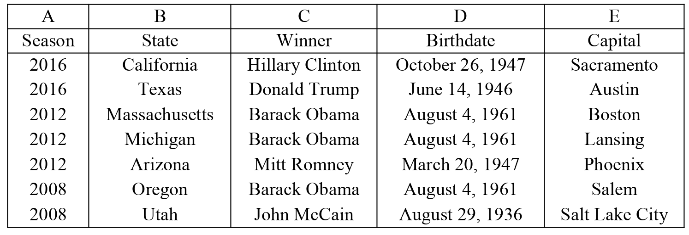
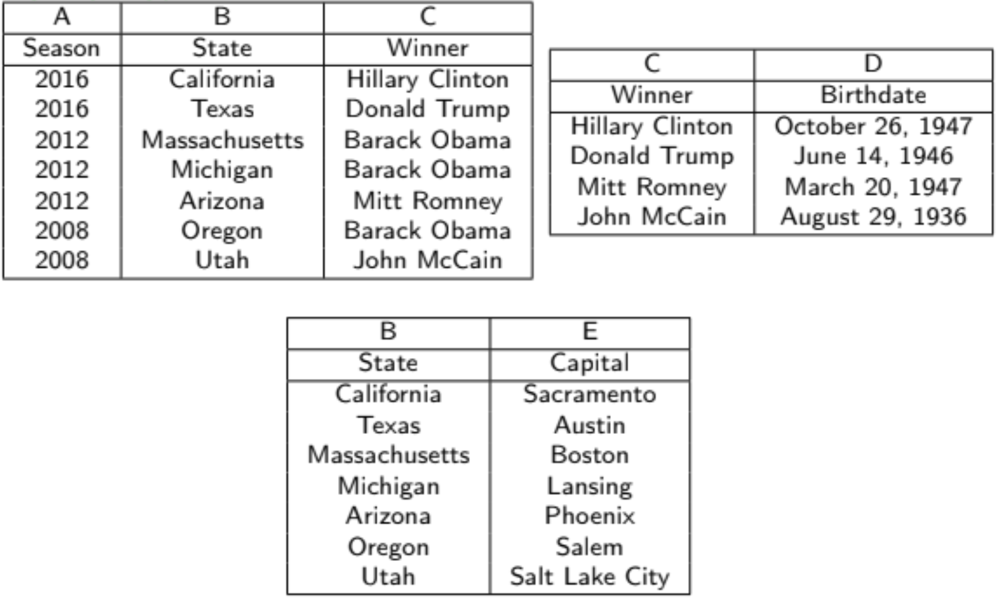

# Lecture 12 - Functional Dependencies and Normalization 5/15/19

## Functional Dependencies and Normalization

* Normalization is the process of refactoring tables to reduce
    redundancy in a relation. Normalization involves splitting a table
    with redundant data into two or more non-redundant tables.
* When there are redundancies in a table, we can decompose the
    table using functional dependencies.
* Problems with denormalized tables stem from redundancy, data integrity issues, and
    delay in creating new records
* Denormalized tables can be used for OLAP, data warehousing, and read-only read-heavy
    tables
    * We need to query aggregates FAST - denormalized tables are faster to query when
        we know exactly what we are searching for
    * Data integrity is not an issue, since its assumed another system did that
    * No delays in creating records because we do not create records in OLAP, the
        system does it for us on some schedule.

#### Functional Dependencies

* To determine if a table needs to be normalized, we define a series of rules called
    functional dependencies
* Given a relation $R$, with attributes $X \in R$, $X$ is said to functionally determine
    another set of attributes $Y \in R$ if each value $X \in R$ is associated with one
    $Y \in R$. The $R$ is said to satisfy the functional dependency $X \rightarrow Y$
* In the functional dependency $FD: X \rightarrow Y$ means that two tuples with the same
    value of $X$ must also have the same value for $Y$, the converse is not true
* Rember that a **superkey** is a set of attributes $K$ in a relation $R$ such that no
    two tuples in the relation share the same values on all of the attributes $K$. There
    can be many superkeys in a relation
* If $K$ is a superkey, and we take the projection of $R$ over that superkey, it has the
    same cardinality as $R$
    \begin{equation}
    | \Pi_{K}R | = |R|
    \end{equation}
* A candidate key is a minimal superkey, with the smallest number of attributes, there
    can again be multiple candidate keys if they are independently unique, or there is a
    bijection mapping among the candidate keys
* Finally, the **primary key** is just the candidate key that is chosen to
    uniquely identify tuples in a relation
* Let $\alpha, \beta, \gamma$ be sets of attributes in a relation $r(R)$, then they have
    the following properties:
    1. **Reflexivity**: If $\beta \subseteq \alpha$, then $\alpha \rightarrow \beta$
    2. **Augmentation**: If $\alpha \rightarrow \beta$, then
        $\alpha\gamma \rightarrow \beta\gamma$
    3. **Transitivity**: If $\alpha \rightarrow \beta$, and $\beta \rightarrow \gamma$,
       then $\alpha \rightarrow \gamma$
* From those first rules, the following can be derived:
    1. **Union**: If $\alpha \rightarrow \beta$ and $\alpha \rightarrow \gamma$ then
        $\alpha \rightarrow \beta\gamma$
    2. **Decomposition**: If $\alpha \rightarrow \beta\gamma$, then
        $\alpha \rightarrow \beta$ and $\alpha \rightarrow \gamma$
    3. **Psuedotransitivity**: If $\alpha \rightarrow \beta$, and
        $\Delta\beta \rightarrow \gamma$, then $\Delta\alpha \rightarrow \gamma$
    4. **Composition**: If $\alpha \rightarrow \beta$, and $\gamma \rightarrow \Delta$,
       then $\alpha\gamma \rightarrow \beta\Delta$

#### Atomic Attributes and First Normal Form

* Up till now in the course, attributes have been treated as atomic, indivisible units,
    so there is no unique key, they are flat and simple, and they are not collections
* If these conditions hold, we say this is in the first normal form (1NF)
* To convert a relation into 1NF, we add a primary key, remove any
    attributes that are collections and try to remove NULLs.

#### Second Normal Form (2NF)

* Decomposing a table down to 2NF allows for separation of concerns.
* A relation $R$ is in 2NF if and only if for every attribute in $R$ one of the
    following is true:
    1. The attribute appears in a candidate key;
    2. Is not partially dependent on the candidate key
* **Note**: $R$ must also be in 1NF
* The following table shows which party won each state in a general election with State
    and Season as the candidate

    { width=50% }
* This has the following functional dependencies
    1. $AB \rightarrow C$
    2. $C \rightarrow D$
    3. $B \rightarrow E$
    4. $E \rightarrow B$
    * **Note**: we also get $AB \rightarrow D$ via transitivity
* The candidate key here is the composite Season and State (AB).
* Birthdate has a partial dependency on the key. Birthdate depends on only Winner.
    This relation violates 2NF.
* To actually make this table compliant to 2NF, you would have to convert it like so:

    { width=50% }

#### Third Normal Form (3NF)

* For a table to be in **third normal form**, it must be 2NF, and not contain any
    attributes that are functionally dependent on any attributes that are not themselves
    a candidate key
* This also means that no attributes can be functionally determined by transitivity
* With the election table, we had that $AB \rightarrow C$ and $C \rightarrow D$, the
    dependency $C \rightarrow D$ is problematic since $D$ is functionally determined by
    $C$ which is not a candidate key. This violates 3NF, but works under 2NF
* **Closure**
    * A closure $F^{+}$ of $F$s is the full set of functional dependencies that can be
        logically implied given a set of functional dependencies and a set of axioms.
    * Suppose we have that:
        1. $A \rightarrow B$
        2. $A \rightarrow C$
        3. $CG \rightarrow H$
        4. $CG \rightarrow I$
        5. $B \rightarrow H$
    * We find the closure for $A$ as follows:
        1. $A \rightarrow H$ using (1) and (5) transitivity
        2. $CG \rightarrow HI$ using (3), (4) and union rule
        3. $AG \rightarrow CG$ using (2) and augmentation
        4. $AG \rightarrow I$ using (4) and transitivity
    * Then we have that:
        \begin{equation}
        F^{+} = \{A\rightarrow H, CG\rightarrow HI, AG\rightarrow CG, AG\rightarrow I\}
        \end{equation}
* Relation schema $R$ is said to be in third normal form with respect to $F$ if, for
    every functional dependency in the closure $F^+$ of the form
    $\alpha\rightarrow\beta$, $\alpha \subseteq R$, $\beta \subseteq R$, at least one of
    the following is true:
    1. $\alpha \rightarrow \beta$ is a trivial functional dependency
    2. $\alpha$ is a superkey for $R$
    3. Each attribute $A$ in $\beta - \alpha$ is explicitily containted in a candidate
        key for $R$

#### Making a Relation BCNF

* Let $R$ be a relation that is not in BCNF. By definition, this means that $D$ at least one
    non-trivial functional dependency $f:\alpha \rightarrow \beta$ such that $\alpha$ is
    not a superkey for $R$
* So we essentially split $R$ into two relations: one with $\alpha$ and $\beta$, and one
    with $\alpha$ and everything except $\beta$
* When we decompose relations, we want to be sure that the decomposition is lossless.
* That is, if we decompose $R$ into $R_1$ and $R_2$, we want
    \begin{equation}
    \Pi_{Attributes \in R_1}(R) \bowtie \Pi_{Attributes \in R_2}(R) = R
    \end{equation}
* And, given a set of functional dependencies, we can check that the decomposition is
    lossless:
    1. $R_1 \cup R_2 = R$
    2. $R_1 \cap R_2 \neq \{\}$
    3. $R_1 \cap R_2 \rightarrow R_1$ or $R_1 \cap R_2 \rightarrow R_2$, so $R_1 \cap
       R_2$ forms a superkey for either $R_1$ or $R_2$
* If we are going to decompose a large table into two or more smaller
    ones to reduce redundancy, we better make sure that we do not
    lose any information when we do the decomposition.
* A decomposition is said to be lossless if we can reconstruct the original relation R
    with a series of natural joins
    \begin{equation}
    R = R_1 \bowtie R_2 \bowtie ... \bowtie R_n
    \end{equation}
* When we decompose relations to BCNF or other forms, we want to study whether or not 
    the decomposition is dependency preserving.
* Suppose $R$ is decomposed into subrelations $R_i$, let $F_i$ be the set of dependencies
    in $F^+$ that includes only attributes in $R_i$
    1. A decomposition is dependency preserving if
        \begin{equation}
        (F_1 \cup F_2 \cup ... \cup F_n)^{+} = F^{+}
        \end{equation}
    2. If the decomposition is not, then checking for updates that violate functional 
        dependencies may require computing joins, which is expensive
