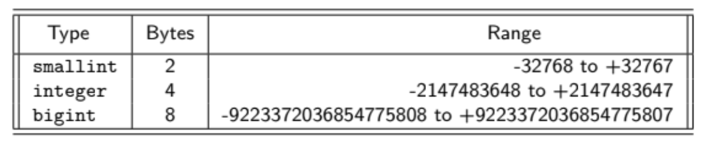
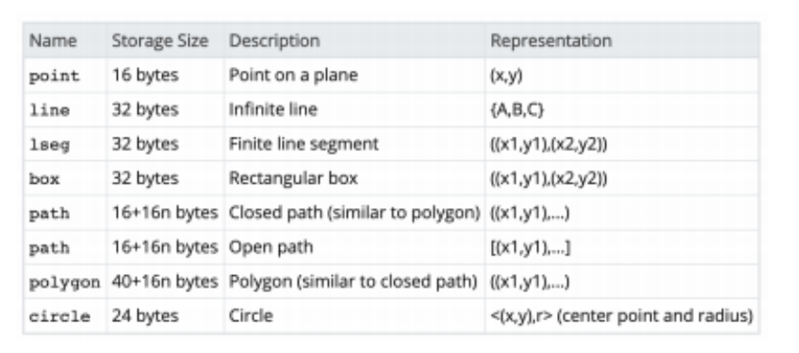

## Lecture 2 - Introduction to SQL - 4/10/19

#### Why use PostgreSQL?

* MySQL is owned by Oracle, PostgreSQL is open-source
* PostgreSQL is largly ANSI SQL compliant
* PostgreSQL has better support for complex queries
* Users can read query execution plans
    * Lets you see what the database is going to do before you run the command
    * This is done with the command `EXPLAIN`
* PostgreSQL has appropriate security and authorization model
* Extensible and flexible type system similar to programming language
* Supports of indexing on JSON/XML

#### ANSI SQL Types

* ANSI SQL standard defines a lot of typess, supports different basic types such as
    * numeric
    * string/text
    * binary
    * dates and times

#### Number Types

* integer represents an integer defined in the database by the machine
* smallint represents a restricted domain int
* numeric(p, d) represents a fixed-point number containing p digits and d digits
    after the decimal
* real, double precision represents a double
* float(n) represents a floating-point number with n digits of precision
* In PostgreSQL, the only integer types supported are smallint, integer, and bigint
* These have the following characteristics

    { width=50% }

* PostgreSQL also supports Fixed-Point Types, for example `DECIMAL(p, d)` where p is
    the precision while d is the scale
    * d just means how many of the p digits come after of the decimal
* Inserting a value that has a scale larger than the scale declared in the schema will
    result in the number getting rounded
* Specific value of NaN exists, which is greater than all non-NaN values
* The maximum precision that can be specified is 1000
* **Note**: `numeric` and `decimal` are slow in PostgreSQL
* For Floating types, there are also the values `Infinity` and `-Infinity` as well as `NaN`

#### Strings

* char(n) is a fixed length character strong with a length of n characters
    * Note that this will get padded with 0s if you put in less than n chars
    * In PostgreSQL it actually pads with spaces
* varchar(n) is the variable length character string that can have up to n characters
* Note in PostgreSQL, casting a `varchar(m)` to `char(n)` where $m > n$, this will result in
    truncation
* Short strings ($len \leq 126$) have an overhead of one extra byte, longer strings have up to 4
* Unlike other database systems, there is no performance gain of using `character` over oher
    small string types.
    * `character` requires extra space for padding so for small strings it is the slowest

#### Dates and Times

* date is the calander date of the form (yyyy-mm-dd)
    * In PostgreSQL date is 4 bytes
* time is the time of day, of the form (HH-MM-SS)
    * In PostgreSQL, time is 8 bytes while timetz is 12 bytes
* timestamp - combines dat and time into the form (yyyy-mm-dd HH-MM-SS)
    * In PostgreSQL, timestamp and timestamptz are both 8 bytes, where timestamptz also stores
        the time zone
* epoch represents unix time
* `infinity` and `-infinity` which represents greater or less than all date times
* There are several SQL functions to get the current date or time: `CURRENT_DATE, CURRENT_TIME`,
    etc
* `allballs` is 00:00:00:00 UTC and only a valid `time` type

**Note**: The `NULL` value represents a lack of data

#### Binary Data

* The only binary data type is `bytea` which is used for storing raw bytes
* The boolean type also exists, which has 3 possible values (`TRUE`, `FALSE`, `NULL`)
* Bitstrings also exist in PostgreSQL which are arrays of `0` or `1`

#### ENUM Types

* MySQL is just a string represented internally as an integer. In PostgreSQL, it is
    an actual type.

    ```sql
    CREATE TYPE mood AS ENUM ('sad', 'neutral', 'happy', 'mad')
    CREATE TABLE person (
        name varchar(255),
        current_mood mood
    )
    ```
* `ENUMS` are case sensitive and whitespace matters
* They take up 4 bytes
* Unlike MySQL, PostgreSQL ENUMS support type safety

#### Geometric Data Types

* PostgreSQL is actually really good for using geometric and spacial data types
    * MongoDB is also pretty good, but not relational like PostgreSQL
* These data types allow you to specify multiple shapes like lines, points, paths, etc

    { width=50% }

#### JSON and XML

* PostgreSQL allows native storage and retrieval of JSON and XML, you can for example
    index on a particular key that is nested in the JSON
* Once a table is assigned, it might be common to store json blobs as members of the column
    in a specific tuple. This allows you to specify an miscellaneous attributes

#### Creating a Relational Table

* Can use the `CREATE TABLE` syntax
* Example of creating a table

    ```sql
    CREATE TYPE privacy_setting AS ENUM ('public ', 'private ', 'unlisted ');
    CREATE TYPE location AS ( latitude point , longitude point );
    CREATE TABLE youtube_video (
            video _id               character(11) UNIQUE NOT NULL,
            title                   varchar(100) NOT NULL,
            channel                 character(24) NOT NULL,
            cat_id                  smallint,
                -- could also be ENUM with names
            likes                   integer,
            dislikes                integer,
            views                   integer,
            post_date               timestamptz NOT NULL DEFAULT CURRENT_TIMESTAMP,
            duration                interval,
            privacy                 privacy_setting,
            content                 bytea NOT NULL,
            extra_data              jsonb,
            PRIMARY KEY (video_id)
            FOREIGN KEY (channel) REFERENCES youtube_channel(channel_id)
    );
    ```
* Primary keys need to be `NOT NULL` and `UNIQUE`
* Foreign keys can be specified in a similar fashion to primary keys
* Can also add default values using `DEFAULT` followed by the value

#### Changing a Table's Schema

* If you need to change a table's schema, can do that with `ALTER TABLE`
* `ALTER TABLE` allows us to
    * Add and drop attributes
    * Add/drop primary and foreign keys
    * Rename relations and attributes
    * Add indices and constraints
    * Change data types of columns
* Here is an example of altering a table's schema

    ```sql
    ALTER TABLE youtube_video
        DROP cat_id,
        MODIFY video_id CHAR(12),
            -- add a 12th character to video_id
        ADD flagged BIT AFTER channel,
            -- add a boolean flag for flagged videos
        ADD rowno INT FIRST,
        DROP PRIMARY KEY,
    RENAME TO youtube_videos;
    ```
* Note: can also alter a table's foreign key using a similar syntax as above

#### Databases, Schemas, Relations/Tables

* Postgres Organizes data differently than MySQL. In MySQL databases are sets of tables
    where each database serves some different use case
* MySQL allows querying across your databases, Postgres does not
* In Postgres you want to create multiple schemas within one database
* Two common keywords in PostgreSQL are `CASCADE` and `RESTRICT`
* If you have a database where relation R with primary key K and a second relation S
    with that foreign key K, what happens when you delete R?
    * If you add `CASCADE`, S will be deleted as well, while `RESTRICT` will cause
        Postgres to see that S will be affected and throw an error.

#### Dropping, Deleting, and Truncating

* Can remove relations using `DROP`

    ```sql
    DROP TABLE IF EXISTS youtube_videos;
    ```
* Can also drop Databases

    ```sql
    DROP DATABASE IF EXISTS my_old_db;
    ```
* Dropping a schema can be done with:

    ```sql
    DROP SCHEMA IF EXISTS my_schema;
    ```
* If you want to clear out all of the data in a table, but keep the relation and its schema,
    is to truncate the relation or delete from it

    ```sql
    TRUNCATE youtube_videos
    ```
* If you want to delete specific data, can do a `DELETE FROM ... WHERE` clause

    ```sql
    DELETE FROM youtube_videos WHERE views = 0;
    ```

#### Removing Duplicates

* In a standard SQL, `SELECT` removes duplicates because it is a projection ($\Pi$)
* If you want to know which professors are teaching some class, we can use `DISTINCT`

    ```sql
    SELECT DISTINCT instructor
    FROM instructor_course;
    ```
* `DISTINCT` is applied to all columns in the `SELECT`

#### Functions, Arithmetic and Renaming/Aliasing

* Can also do basic math on columns during a query

    ```sql
    SELECT
        video_id,
        title,
        (likes / dislikes)::float AS ratio,
        (views / 1000000)::float AS millions_views,
        (likes / (likes + dislikes))::float AS pcd_liked
    FROM youtube_video;
    ```

#### The ORDER Clause

* Sometimes the data we have returned from the `SELECT` clause needs to be
    ordered, this can be done with `ORDER BY`

    ```sql
    SELECT
            uid,
            last_name,
            first_name
    FROM roster
    ORDER BY last_name, first_name;
    ```
* Note that the default sorting order is ascending order
* If you want descending order, can add a `DESC`
* `LIMIT` also lets you limit the number of results to s specified number

    ```sql
    SELECT
            uid, last_name, first_name, gpa
    FROM roster
    ORDER BY
        gpa DESC, last_name, first_name
    LIMIT 2;
    ```
#### Pagination

* If you have 200 students and you want to show 20 students per page, you can have a limit
    of 20, and then the next query will be offset by 20

    ```sql
    SELECT
            uid,
            last_name,
            first_name
    FROM roster
    ORDER BY last_name, first_name
    LIMIT 20
    OFFSET 20;
    ```

#### Aggregation

* There are two types of aggregations, those over an entire relation and aggregations on a group
* For example, if you wanted summary statistics of GPA across the entire BruinBase, I can just issue
    a staight up query with aggregation functions:

    ```sql
    SELECT
            AVG(gpa) AS average,
            MIN(gpa) AS minimum,
            MAX(gpa) AS maximum,
            COUNT(gpa) AS number_of_students
    FROM BruinBase
    ```


* This will return one row consisting of all these statistics
* You can also have aggregations grouped by different attributes, for example if you wanted the
    average gpa by major

    ```sql
    SELECT
            major,
            AVG(gpa)::numeric(3,2) AS average
    FROM BruinBase
    GROUP BY MAJOR
    ```
* You can then combine all these concepts into one giant query

    ```sql
    SELECT
        major,
        AVG(gpa)::decimal(3,2) AS average
    FROM BruinBase
    WHERE class_level = 'UG'
    GROUP BY major
    HAVING AVG(gpa) < 3.95
    ORDER BY average DESC
    LIMIT 2;
    ```
* In general, the order of statements goes
    1. `SELECT`
    2. `FROM`
    3. `JOIN`
    4. `WHERE`
    5. `GROUP BY`
    6. `HAVING`
    7. `ORDER BY`
    8. `LIMIT`
    9. `OFFSET`

