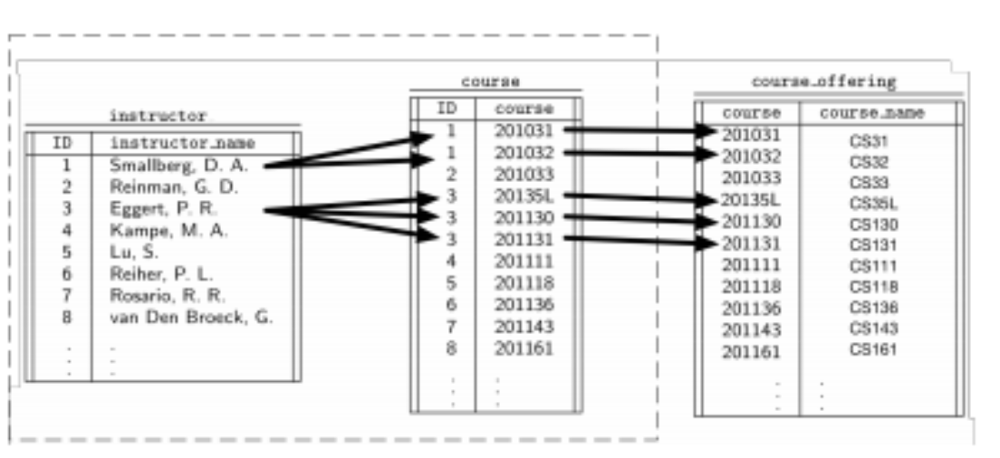
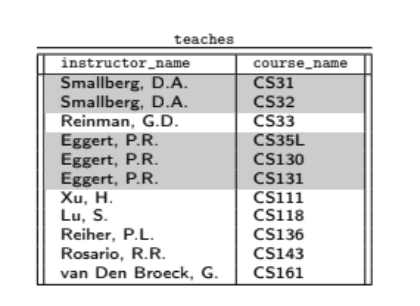
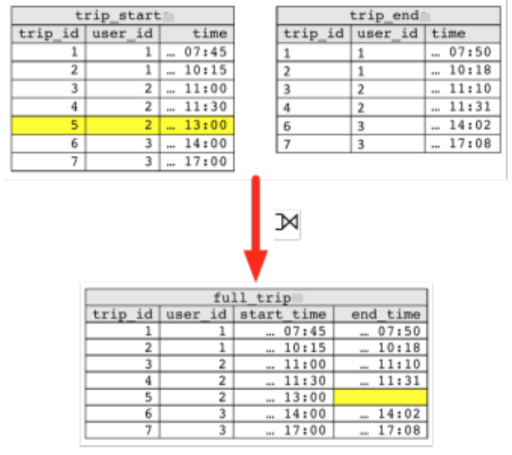
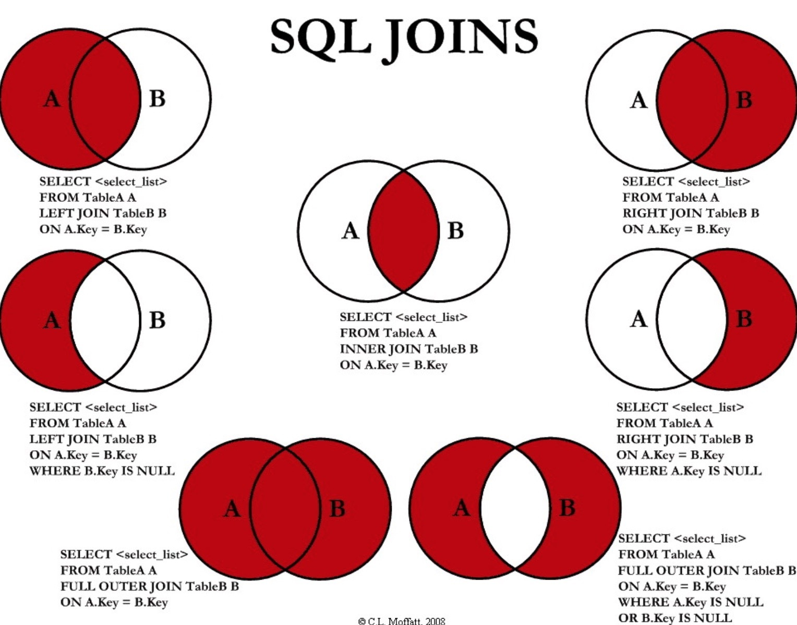

## Lecture 4 - More on SQL - 4/15/19

#### HAVING

1. `WHERE` is essentially a pre-filter on the query, `HAVING` is a post-filter,
    where the `HAVING` clause is applied to the aggregation instead
2. Suppose you want the average GPA by major. Can specify major as a grouping
    variable and specify it in a `GROUP BY` and then using the `HAVING` clause
    to only keep the majors with GPAs over a 3.95

    ```sql
    SELECT
            major
            AVG(gpa) AS average
    FROM bruinbase
    GROUP BY major
    HAVING AVG(gpa) > 3.95
    ```
3. Note that average in the previous query is just for aesthetics, you cannot use aliases
    in `HAVING` clauses

#### Handling `NULL` Values

1. Note that `NULL = NULL` will return `NULL`, except comparisons involving the trivial
   `IS NULL`, `IS NOT NULL`, should always check for `NULL` like this
2. Aggregations ignore `NULL`
3. So here is what happens in PostgreSQL, roughly speaking, `NaN` has precendence, and `NULL`
    is ignored

    { width=50% }

#### Processing Text with PostgreSQL

1. The `LIKE` Operator triest to match text with a pattern specified by %, which matches any
    number of characters wherever it is placed
    * % will match any number of characters, while _ will match 1 char
2. 'CAST' can be used to convert a particular value to a new data type for the current query only.
    * For example if you only want the `time` portion of a 'timestamp' you can cast:

        ```sql
        SELECT CAST(NOW() AS DATE);
        SELECT NOW()::date;
        ```

#### Control Flow

1. The `COALESCE()` operator returns the first non-NULL value in a collection
2. The `CASE` operator works similar to a switch in other languages
3. A `NULLIF()` construct returns `NULL` on invalid data, based on an equality
4. Suppose you want to take bruinbase and change gpa to midterm score to create a new table
    * If a student has a `NULL` midterm value, can force this `NULL` into a zero using `COALESCE`

        ```sql
        SELECT
            uid, last, first
            COALESCE(midterm_score, 0) as midterm_score
        FROM roster
        ```
    * Can then combine all of these operations to create a cleaner view of the data

        ```sql
        SELECT
                uid,
                UPPER(CONCAT(last, ', ', first, COALESCE(' ' || middle, ''))) as name,
                CASE class_level
                        WHEN 'USR' THEN 'Senior'
                        WHEN 'UJR' THEN 'Junior'
                        WHEN 'USO' THEN 'Sophomore'
                        WHEN 'UFR' THEN 'Freshman'
                END AS class_level
                NULLIF(major, 'Undeclared') AS major,
                COALESCE(midterm_score, 0) as midterm_score
        FROM extended_roster
        ```

## Modifying Data

#### Adding New Rows

1. `INSERT` can be used to add a new row into a table

    ```sql
    INSERT INTO relation VALUES ('val1', 'val2', ... , 'valn')
    ```
    Where (...) denotes a tuple of data, with strings in single quotes
2. If you only want to insert some of the values in the new row you must give the names
    of the columns

    ```sql
    INSERT INTO relation (col1, ... , colnname) VALUES
        ('val1_1', ... , 'val1_n'), ('val2_1', ... , 'val2_n'),
        ...,
        ('valn_1', ... , 'valn_n');
    ```
3. If you don't specify all the columns in the `INSERT` statement, then the other columns will
    be set to their default values.

#### Modifying Rows

1. Rows in a table can be modified using the `UPDATE`. Which usually has one of the following forms

    ```sql
    UPDATE relation
    SET column = new_value
    WHERE some_condition
    ```
2. Can for example update all midterm scores for all students by adding 2 to all of them

    ```sql
    UPDATE extended_roster SET midterm_score = midterm_score + 2;
    ```
3. Can also pair an `UPDATE` with a `WHERE` clause if you want to only update a specific table

#### Joins: Querying Multiple Relations

1. `JOIN` is used for combining multiple relations into one during a query
2. `NATURAL JOIN` is typically very powerful but in relational algebra, but typically not used
    in SQL.
    * `NATURAL JOIN` just does not have a condition, it is picked automatically and is based on
        an equality
3. `INNER JOIN` is much more common because we explicitly state what we want to join on, so we
    don't have to rely on the relational database to find common attributes
4. **Note**: JOIN Types are usually explicitly, otherwise it defaults to an `INNER JOIN`


#### The Inner Join

1. The inner join is the most basic and common join, given to relations R and S, the inner join
    concatenates records where the join keys match on both relations, so it is $R \cap S$

    { width=50% }

2. This above query will result in the following table

    { width=30% }

3. Note that if you have m rows and n copies of a row on the right, then the result will have $mn$
    combinations representing the particular set of values on the join keys.

#### Types of Joins

There are several types of joins, characterized by the following:

* Based on the operator used in the join clause
    * It is most common to use the = operator, however, it is possible to use all other
        boolean operators. These are called non-equijoin
* Based on how rows/records are matched and how we deal with rows/records
* Based on whether or not a second distinct table is used in the join
* Based on whether or not we explicitly state the columns used in the join.

#### The CROSS JOIN

1. The cross join between two relations $R$ and $S$ is simply the Cartesian product denoted by
    $R \times S$
2. Cross joins are typically very rare and not used frequently

#### The OUTER JOIN

1. With `INNER JOIN`, you only return records where the values of the join key match both tables
   involved in the join. This is not the case with `OUTER JOINS`
2. `OUTER JOINS` will keep all entries and fill the columns from the other table as `NULL`
3. The `LEFT [OUTER] JOIN` will try to match records from the left table to the right table.
    * If a match is found, we form a  new record by concatenating the results
    * If a match is not found, the values from the left table are kept and they are concatenated
        with `NULL` values from the right table
4. An example is if you have trips with a start time and an end time, but you don't have all the
   end times for any plethora of reasons, then a `LEFT OUTER JOIN` will do the following:

      { width=30% }

5. The above query could be written as

    ```sql
    SELECT
            L.trip _id AS trip_id,
            L.user _id AS user_id,
            L. time AS start_time,
            R. time AS end_time
    FROM trip_start L
    LEFT JOIN trip_end R
    ON L.trip_id = R.trip_id AND L.user_id = R.user_id
    ```
6. The `RIGHT [OUTER] JOIN` does the exact opposite of the `LEFT [OUTER] JOIN` while the `FULL
   [OUTER] JOIN` combines the results of the left and right outer joins.

   { width=45% }


