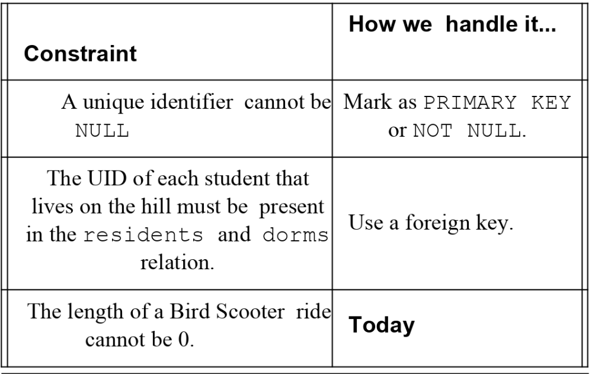

## Lecture 5 - More on SQL - 4/15/19

## Nested Queries

#### Nested Queries/Subqueries

* Subqueries are clauses that are run before having a `WHERE` clause query on that query.

    ```sql
    SELECT
            major,
            average
    FROM (
        SELECT
            major,
            AVG (gpa):: decimal (3,2) AS average
        FROM bruinbase
        GROUP BY major

    ) sq
    WHERE average > 3.95
    ```
* Subqueries are always executed first, and in PostgreSQL, a subquery can be nested inside
    a `SELECT`, `INSERT`, `UPDATE`, `DELETE`, `SET`, or `DO` statement
* Usefull for constructing derived tables, set comparison, testing empty subsets/relations
    or testing uniqueness

#### Constructing Derived Tables

* The result of a subquery is sometimes called a derived table
* For example if you take a midterm scores table and want to compute the z-score of each
    student's midterm score by undergrad/grad. Can do this using the z score equation
    \begin{equation}
    z = \frac{x-\mu}{\sigma}
    \end{equation}
    Afer this, the corresponding query is:

    ```sql
    SELECT
        uid , last , first , middle , L.career,
        midterm_score, (midterm_score - mean) / sd AS z_score
        FROM (
            SELECT
                career,
                AVG(midterm_score_) AS mean,
                STDDEV(midterm_score) AS sd
                extended_roster
            FROM roster
            GROUP BY Career
        )
        JOIN extended_roster R
        ON L.career = R.career
    ```
* Note that all derived tables must have an alias
* Can also use a subquery in the `JOIN` clause in the same way as the `FROM`

#### Dynamically Computing Constants: Correlated Subqueries

* Sometimes want to filter records by some boolean expression that requires a constant
    that cannot be precomputed
* Can use a subquery to compute the constant and then use it in the main query
* Say you want to identify students that scored at least a 0.5 standard deviations above
    the full class mean
    * Could do this by taking the previous query, drop the `GROUP BY`, throw it into a
        subquery, and then use a `WHERE` clause
    * Can precompute the $z = \frac{1}{2}\sigma +\mu$ in a subquery and use it into
        another query

        ```sql
        SELECT
            uid, last,
        FROM extended_roster
        WHERE midterm_score >
        ( -- this subquery makes the constant
          -- available to the outer query
            SELECT
                AVG (midterm_score + 0.5 * STDDEV (midterm_score))
            FROM extended_roster
        );
        ```
* **Note**: Correlated Subqueries are very inefficient. The subquery is recomputed for every
    row, wheras a standard subquery is executed only once.
* By using `EXPLAIN ANALYZE` before the query, we get an AST showing the query plan, the steps
    the RDBMS will take to carry out the query

* Scalar Subqueries compute a constant directly into a column via `SELECT`. For example:

    ```sql
    SELECT
        name,
        (SELECT max(pop) FROM cities WHERE
            cities.state = states.name)
    FROM states;
    ```
#### Performance: Subqueries vs Joins

* Joins can be very expensive on very large tables. We typically want to filter before the join.
    Only keep the columns or rows we need to reduce the load. This filtering is usually done with a
    subquery
* Subqueries do not perform great on MySQL, and a `LEFT OUTER JOIN` is often preferable
* Joins, and subqueries before joins, tend to be the most performant. This always depends on the
    optimizer

## Constaints

* We will dive into explicitly defining constraints on tables using the `CREATE TABLE` syntax
* Here are some examples of constraints and how we currently handle them

    { width=50% }

* In the SQL standard, can impose constraints on the table using the `CHECK` clause. The CHECK
    clause can be an expression or a subquery
* An example from hw1 is:

    ```sql
    CREATE TABLE rides2017 (
        origin          char(4),
        destination     char(4),
        throughout      int,
        datetime        timestamp,
        PRIMARY KEY (origin, destination, datetime),
        CHECK(origin IN ('BALB', 'POWL', ...) AND destination IN ('BALB', 'POWL', ...))
    );
    ```
* Can also put a subquery after the `IN` statement inside the check
* Using constraints is a judgement call. Some developers prefer to use a database just for storage
    and insert all logic into the application
* There are a few ways of specifying constraints when `CHECK` is not supported:
    1. Primary keys
    2. Foreign keys
    3. `UNIQUE`
    4. views
    5. triggers
    6. generated columns


#### UNIQUE

* Note that all values of a primary key must be unique, for a composite key, each pair must be
    unique across the table but the values in each column do not necessarily need to be unique
* `UNIQUE` works the same way as a primary key, the `UNIQUE` keyword can be written inline, or at
    the end of the `CREATE TABLE`
* If we want to specify that both the email address and the credit card number must form a unique
    pair can do this by:

    ```sql
    CREATE TABLE user (
        user_id         SOME_TYPE_SPEC,
        ...
        ccnum           SOME_TYPE_SPEC,
        email           SOME_TYPE_SPEC
        UNIQUE(email, ccnum)
    )
    ```

## Views

#### Getting a Better VIEW

* So far, we have only worked with tables, which are implementations of relations, which are
    logic-level concepts. Views are now on the view-level which is what we would typically show to
    a user
* A view is essentially a shallow copy or a reference to a table
* A view is basically a "virtual table" that exposes only certain information to the user.
* Creating a view is very simple:

    ```sql
    CREATE VIEW name_of_view AS
        (sql-query)
    ```
* What happens when the underlying data changes?
    * A standard view is just a window of the table, each time the view is accessed, the query for
        the view is updated
    * There is no performance gain to using a plain view over the table, but it does hide some data
        from the tables and it is always up-to-date

#### Materialized Views
* A **materialized view** caches a resultset on disk, we query it just like a table and we have a
    performance similar to a table
    * The query associated with materialized views may take a long time to generate the result, so
        materialized views must be refresed "manually" once in a while
* Example creation of a materialized view:
    ```sql
    CREATE MATERIALIZED VIEW ucla_scooters AS
        SELECT
            scooter_id
            batter_power,
            last_known_location
        FROM scooter_status
        WHERE home_location - 1919;
    ```
* Just like variable references, views do not hold any data. Materialized views do cache data
* As the data in underlying tables change, a view recomputes the query on access, while a
    materialized view must be manually updated
* View definitions are stored in a schema

#### Updated Data Through Views

* One common characteristic used to descrive database systems is whether or not the database system
    allows users to modify the underlying tables
* The view may only use certain columns from the underlying tables, so if we try to insert a new
    row into a view, we must also insert the row into the underlying tables
* Each DBMS has different constraints on how to update views. In PostgreSQL

    ```sql
    CREATE OR REPLACE VIEW UPDATE AS
    ... some query ...
    ```

#### Imposing Constraints with Views

* You can specify constraints on a table by using an updateable view that has `WITH CHECK OPTION`
* For example

    ```sql
    CREATE VIEW eligible_users AS
        SELECT *
        FROM user
        WHERE age >= 16
        WITH CHECK OPTION;
    ```
    The app now will insert a new user’s information into the view instead of the table.

## Triggers

* A trigger is a statement that the database executes automatically as a side-effect of modifying
    the database
* Triggers must satisfy two characteristics when created:
    1. **WHEN**: specify when the triffer is to be executed, and what conditions must be met for
       that to happen
    2. **WHAT**: Specify what the trigger will actually do.
* Triggers are created with the following syntax:

    ```sql
    CREATE TRIGGER <triggername>
    <Event>
    <Optional Referencing Clause>
    WHEN ( <optional expression or subquery> )
    <action>;
    ```
* The event spefifies the time point (`BEFORE` or `AFTER`) and a particular operation, like
    `INSERT`, `DELETE`, or `UPDATE`
* The condition is a boolean expression or subquery, while the referencing clause spedifies how we
    refer to the original row (for a `DELETE` or `UPDATE`)
    * The referencing clause looks like `REFERENCING OLD TABLE ROW AS <varname>`
* The action of a trigger is any SQL statement. An example `BEFORE INSERT` trigger is:

    ```sql
    CREATE TABLE account (acct_num INT , amount DECIMAL (10,2));
    CREATE TRIGGER ins_sum BEFORE INSERT ON account
        FOR EACH ROW SET @sum = @sum + NEW.amount;
    ```
    Which we can then trigger with:

    ```sql
    SET @sum = 0;
    INSERT INTO account VALUES(137, 14.98), (141,1937.50), (97,-100.00)
    SELECT @sum AS 'Total amount inserted'
    -- should return 1852.48
    ```
* In an `AFTER INSERT`, the condition will be checked, and then if it fails, the operation will be
    rolled back and undoed, it probably makes more sense to use a `BEFORE INSERT`
