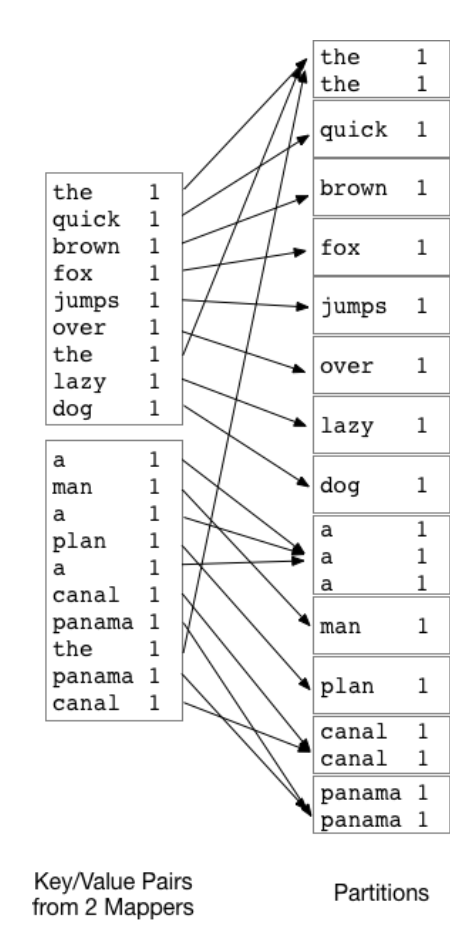
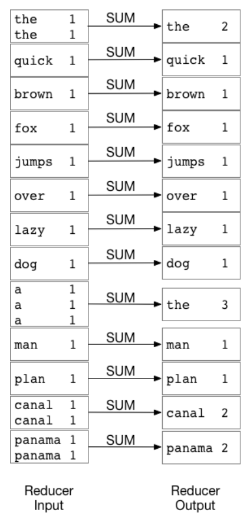
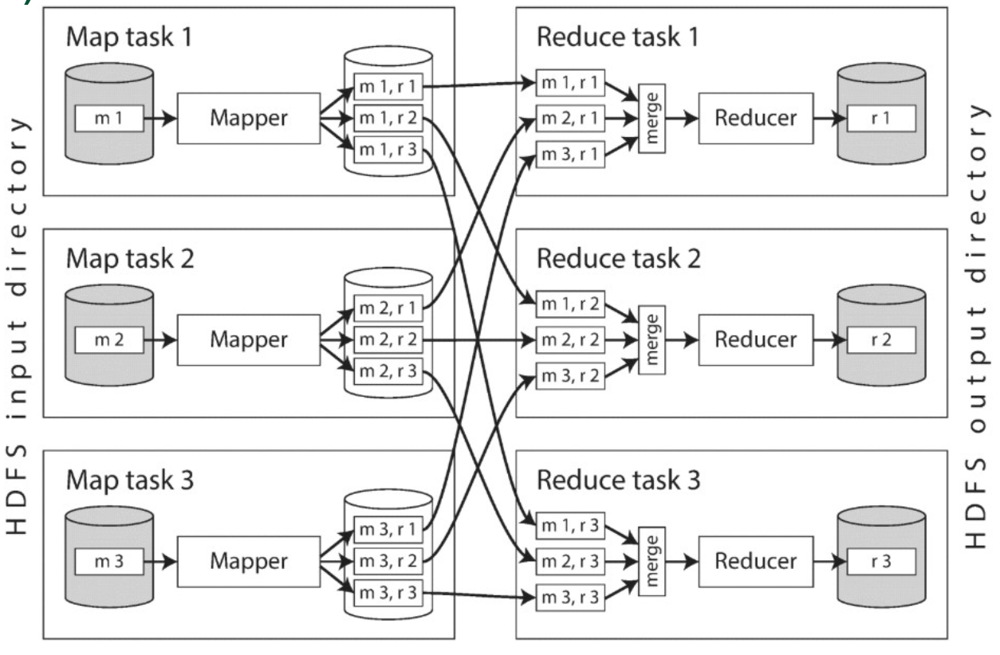
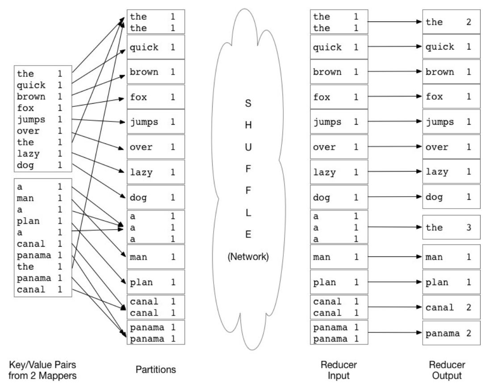

## Lecture 8 - MapReduce - 4/29/19

## MapReduce

* MapReduce consists of two main dataflow stages, but there are actually several more:
    1. Input
    2. MAP
    3. Partition
    4. Comparison
    5. REDUCE
    6. Output
* Suppose we have the text from every English webpage in a cluster, then input here is
    each webpage as a single HTML file.
    * By default, Hadoop reads lines from files, where each line is a record. This is
        often not appropriate, for example a Wikipedia dump is millions of lines in an
        XML file, thats why we need a special class called InputFormat
* InputFormat specifies how records are laid out in files and how to divide the records
    into splits.
* Splits are used to define parallelism; if we split 1 million records into groups of
    1000, we can process the data in 1000 batches concurrently. If we have 1000 CPUs, we
    can finish the job 1000x faster
* Back to the example at hand, we break down the problem to each webpage. We will do some
    text processing like removing html. If we try to scale this using bash with a command
    like:

    ```bash
    cat file | awk ... | sort | uniq -c
    ```
    this will create thousands of subprocesses, and those don't share memory so we will
    run out of space in memory
* Method 1: (does not require extra memory)
    * We don’t need any more memory if we simply output a count each time we
        encounter a word, even if words appear more than once:
    * For the sentence:

    ```
    The quick brown fox jumps over the lazy dog
    ```
    we would output

    | Word          | Count         |
    | ------------- |:-------------:|
    | The           | 1             |
    | quick         | 1             |
    | brown         | 1             |
    | fox           | 1             |
    | jumps         | 1             |
    | over          | 1             |
    | the           | 1             |
    | lazy          | 1             |
    | dog           | 1             |

    This is called the mapping phase
* Method 2: Extra Memory Required (map and combine)
    * We can use extra memory by using our original method, using a data structure
        to aggregate counts from one file and then output the contents of the data
        structure to disk.
    * So in the same previous example, we would create a table:

        | Word          | Count         |
        | ------------- |:-------------:|
        | quick         | 1             |
        | brown         | 1             |
        | fox           | 1             |
        | jumps         | 1             |
        | over          | 1             |
        | the           | 2             |
        | lazy          | 1             |
        | dog           | 1             |

* During the Map Phase, The data are then partitioned. In simple cases, this is a
    simple sort by key (word), but we can also sort by the value of some hash
    function.

    { width=30% }

#### The Reduce Phase

* Each reduce task on a reducer receives a group of key-value pairs, all with the
    same key, and they may come from several machines, so a merge and sort is
    performed a final time.

    { width=28% }

* This however causes problems where some words are much more likely to appear and thus
    will have a key skew, causing some keys to take hours to compute
* The solution to this problem is to create a subkey, so that records
    are more evenly shuffled to reducers.
* We can use an OutputFormat (the output) phase if we want to use some
    other format like Parquet instead of the default one record per file

#### MapReduce: The Big Picture

* MapReduce functions on each split independently. MapReduce is a
    shared-nothing model, and is also embarrassingly parallel

    { width=53% }

* It is very obvious how to divide the problem to make it parallel without any
    horizontal dependencies among splits.

    { width=45% }

* Here is a python example of MapReduce
    * **Python Mapper**

        ```python
        #!/usr/bin/env python
        """mapper.py"""
        import sys

        # input comes from STDIN (standard input)
        # input comes from STDIN (standard input)
        for line in sys.stdin:
        # remove leading and trailing whitespace
        line = line.strip()
        # split the line into words
        words = line.split()
        # increase counters
        for word in words:
        # write the results to STDOUT (standard output). What we output here
        # will be the input for the Reduce step, i.e. the input for reducer.py
        # tab-delimited; the trivial word count is 1
        print("\{\}\t\{\}".format(word, str(1)))
        ```
    * **Python Reducer**

        ```python
        #!/usr/bin/env python
        """ reducer.py """
        from operator import itemgetter, sys

        current_word = None; current_count = 0; word = None

        for line in sys.stdin:
            line = line.strip()
            # split the key/value pair from the mapper
            word, count = line.split('\t', 1)
            count = int(count)
            # this IF only works because Hadoop sorts map output by key (word) 
            # before it is passed to the reducer
            if current_word == word:
                current_count += count
            else:
                if current_word:
                    print("{}\t{}".format(current_word, str(current_count))
                current_count = count
                current_word = word
        # Do not forget to output the last word if needed!
        if current_word == word:
            print("{}\t{}".format(current_word, str(current_count))
        ```

#### SQL in MapReduce 

* MapReduce is typically used on data that is not already in a
    relational format. 
* SQL operations can be performed using combinations of map and
    reduce phases, and even the absence of them:
    * A SQL `WHERE` clause or $\sigma$ can be represented as a map without a reduce phase 
    * An aggregation $\gamma$ can be represented as both a map that constructs key-value
        pairs with groups and a reduce phase that computes the aggregate function on each
        group
* Queries with multiple operations can chain together several map
    and reduce stages to answer the query. 
* Unlike in RDBMS, when using a subquery within a JOIN it is better
    to materialize the intermediate result into a temporary table 
    * This is because a subquery may execute concurrently with a join operation, and a
        join will recompute records as more records are created in the subquery

## Beyond MapReduce

* Relational algebra operators and trees of operators can be represented as a series of
    maps and reduce steps, but this can be cumbersome
* For example, a join in relational algebra is one step but in MapReduce, a join is two
    operations
* More recent parallel systems have added support for one operation joins.
* Most data workflows comprise a series of related steps called a pipeline
* We want to think of our pipeline as consisting of a series of
    algebraic steps that take arbitrary data as input, and output other
    arbitrary data depending on the context, just like RDBMS.
* Apache Spark is an example of such a model, where it uses Resilient Distributed
    Datasets (RDDs) as input and output to/from operators instead of relations.

#### Apache Spark 

* An RDD is resilient because when one node in the distributed system fails, there is a
    replicate elsewhere in system
* The beauty of spark is that its distributed nature is transparent to the user, with
    data treated as a single data structure as if it was on a local machine
* Some noticable advantages of Spark over Hadoop is:
    * Computations are stored in RAM, and stay there until the user
        specifically requests to persist them to disk.
        * Calling collect() will persist results to disk.
    * As operations are entered by the user, Spark constructs an execution DAG
    * Spark can more easily handle iterative problems such as those in machine learning.
    * Spark has been measured to be up to 100x faster than Hadoop when using RAM, and 
        10x faster when using disk/HDFS. 
