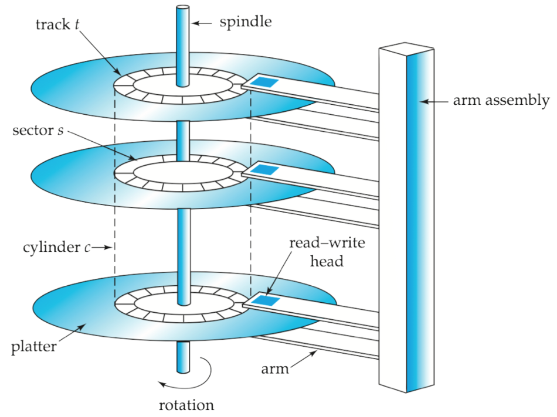
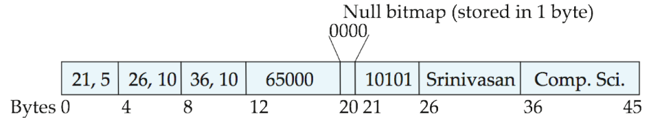
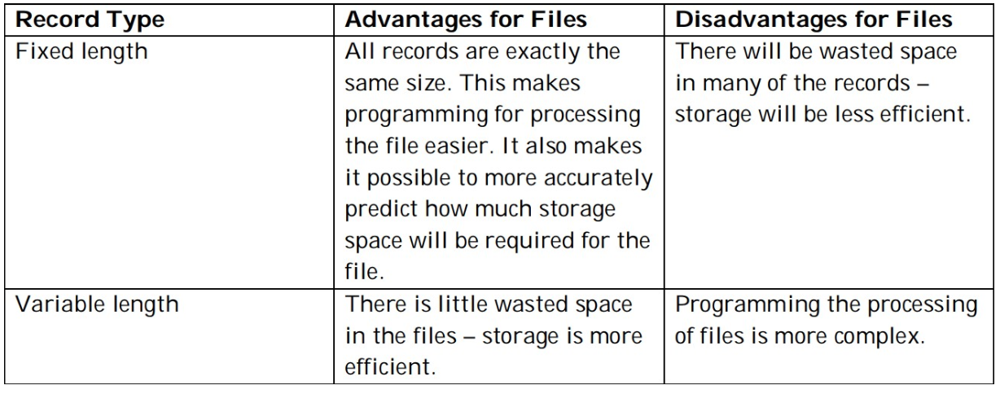
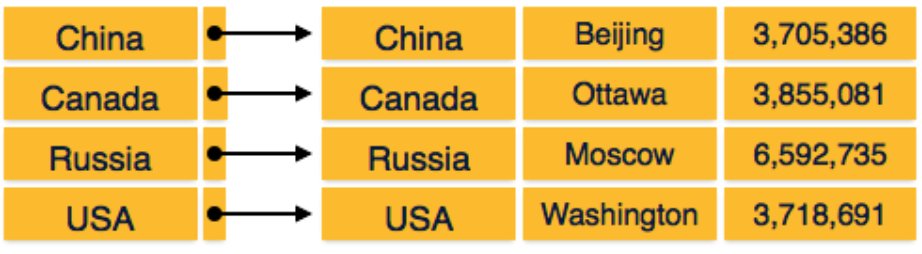
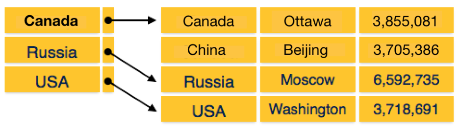
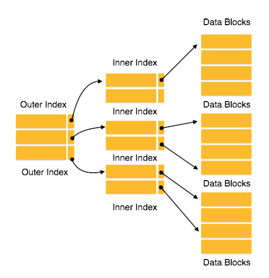
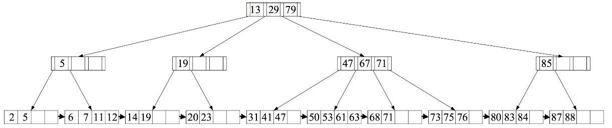
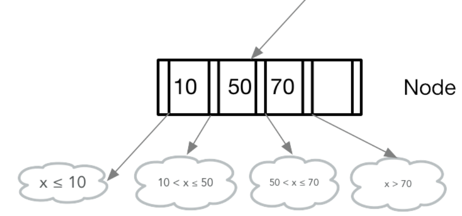

## Lecture 9 - Data Storage and Indices - 5/6/19

## Data Storage

#### Various Methods of Data Storage

* There are variety of ways we can store data on a system, the one we pick will depend on
    the speed of access, cost per unit, and data reliability
* **Cache**
    * fast, but expensive
    * CPUs, GPUs and hard disks all have caches
    * cache stores frequently accessed values so that we don't have to reaccess the RDBMS
* **Main Memory/RAM**
    * Fast and expensive
    * Can serve as cache
    * Data doesn't usually fit into RAM (Spark rarely relies on RAM), need fast way to
        swapp between disk and RAM
    * Volatile memory
* **Solid State**
    * Hybrid of RAM and hard disk
    * SSDs offer fast seek and random access almost as fast as RAM, but the storage is
        nonvolatile
    * SSDs commonly used for RDBMS
* **Magnetic (Hard) Disks:**
    * Very cheap but very slow
    * Used for long-term storage
    * Hard disks up to 10-15 TB in 2019
    * Prone to nasty failures
* **Optical Media**
    * No longer very common (things like DVD(4.7-8.5GB), BluRay (25-128GB))
* **Tape Storage**
    * very, very cheap and just as slow
    * great for long term backup
    * requires sequential access
* **Cloud Storage**
    * Typically is one of the previously mentioned types
    * Lots of tradeoffs
    * Slow

#### Anatomy of Hard Disk

{ width=30% }

* A hard disk consists of a series of circular platters.
* Each platter is divided into circular tracks, with each track
    consisting of many sectors (semi-circles).
* If we recognize the same track of all platters, we have a cylinder
* A motor rotates platters upon a spindle with an arm assembly
* The read/write head floats just above the disk platter surface.
* When the head touches the disk, it can scratch surface causing a head crash.
* Hard disks over some error correction by remapping bad sectors.
* When a hard disk controller detects a secotr of disk that is corrupted, a note will be
    made in the disk's nonvolatile memory to map all requests to that sector to some
    other sector
* Hard disk performance can be measured in terms of access time, seek time, rotational
    latency, data transfer rate, and mean time between failures
    * Note that in this case, access time refers to seek time + latency
* Logical Data Access on Hard Disks
    * **Sequential**: Successive disk requests are for successive block numbers.
    * **Random Access**: Successive requests are for random blocks located throughout
        the disk.
* Disks are very slow, to speed them up, several techniques have been developed
    * **Scheduling**: When a request is made, requests are ordered by cylinder and then
        read in order of cylinder to minimized disk head movement
    * **File Organization**: We can arrange disk blocks in the order we
        expect them to be requested.
    * **Nonvolatile write buffers:**: When writing blocks, may have to wait for the write
        head to be ready, so data is queued somewhere to wait, but if there is a power
        failure, data must not be lost so write requests first write to NVRAM then when
        ready, they are written to disk

#### Solid State Drives

* SSDs on the other hand are optimized for random accesses, so sequential accesses just
    boil down to random accesses
* writes to flash and SSDs are complicated since once a block has been written it cannot
    be easily overwritten
* Performance on SSDs is measured as follows:
    1. Number of block reads per second. Reads can occur in parallel.
    2. Number of block writes per second.
    3. Data transfer rate for sequential reads and writes.

#### Data Architecture in RDBMS

* A database maps logical data to files that are physically stored on
    the hard disk.
* A file consists of a sequence of records, onto disk
    blocks.
* Databases work with records that are stored in files.
* For efficiency, as well as to support data recovery databases must continue to be aware
    of blocks

#### Organizing Records of Files

* Tuples (records) from distinct relations will be of different sizes, so
    there are two ways to store records into files:
    1. Assume all records in the same file have the same length
    2. Allow records in the same file to differ in length
* Problems with fixed-sized records
    * A set of fixed records may not be a multiple of the block size and so there is
        no disk access benefit out of it because records cross block boundaries, so
        certain records requires at least 2 accesses to read or write. This
        is not efficient
    * Difficult to delete a record because then there will be a gap
        between records. This can lead to fragmentation.
* Solutions to fragmentation
    1. Fill the gap with subsequent records, but this will take time to fill
    2. Introduce a file header that contains metadata about the file. Cache the
       addresses of the deleted records and use it to seek the proper block for inserting
       a new record
* One solution to storing variable length records: Split record into 4 parts
    1. A table of contents containing byte offsets and lengths for the
        variable length fields;
    2. A fixed part with fixed data types
    3. A bitmask denoting which attributes are null
    4. A variable part for variable-length attributes that is indexed
        using the “table of contents."
* An example of a variable length record may look like:

    { width=50% }
* Each Block contains a header with the number of records in the block, the location of
    end of free space in the block, and the location and size of each record
* The records themselves are stored in some sequential order within a block
* Al references to records, should reference the header of the block

    { width=50% }

* There are three main ways of organizing records into files
    * **Heap**: Records are put into any block that has room, usually at the end of the
        file. Once stored the record doesn't move. Good for for batch insert
    * **Sequential**: Records are stored in sorted order by some search key. becomes
        inefficient after many modifications since these operations are
        $\mathcal{O}(pnq)$
    * **B+-tree**: Similar to sequential storage, but more efficient after many
        modifications. Operations about $\mathcal{O}(n\log{}n)$
    * **Multitable Clustering**: Multiple tables are stored in one file, and even in the same
        block. This can improve join performance.
    * **Hashing**: Records are stored in a particular block of the file based on the hash
        value mapping to a block number.
* With sequential organization, records are stored in a file in some
    sorted order by key.
* When we delete records, we modify a pointer chain just like when
    deleting from a linked list.

#### Database Buffer

* From an OS, main memory contains a buffer that stores copies of
    disk blocks, and this is managed by the buffer manager, essentially
    a virtual memory manager.
* The buffer manager does the following:
    * Figuring out which blocks must be evicted from the buffer
        when the buffer fills up. This is done with an LRU cache where the list recently
        used block is evicted
    * Figuring out which blocks must be evicted from the buffer when the buffer fills up,
        like don't write to disk when block is being updated
    * Forcing blocks back to disk even if there is room in the buffer
* Databases use a toss immediately schema: as soon as the final row has been processed,
    the blocks associated with the queried tables are cleared

## Indexing and Ordered Indices on Sequential Files

* Usually when write a query we only want to search on particular
    attributes including primary keys and perform joins on foreign keys
    or other join keys. A naive database implementation would rely on $\mathcal{O}(pnq)$
    full table scan to find matches for `JOIN`, `WHERE`, etc. What data structures allow
    for a faster lookup?
* There are two types of indexes:
    1. **Ordered indices**: Based on a sorting of the sort-key values and records
    2. **Hash indices**: Based on a uniform distribution of values
        across a range of buckets.
* The type of index used depends on several factors:
    1. **Acess Type**: equality or range search?
    2. **Access Time**: time it takes to find a particular record
    3. **Insertion Time**: time to insert records
    4. **Deletion Time**: time to delete records
    5. **Space overhead**: space the index data structure requires.

#### Ordered Indices

* In an ordered index, the tuples in a relation are sorted by the key and
    distributed to blocks, because keys are stored sequentially in order, you can use
    binary search to find them in $\mathcal{O}(logkp)$ where $k$ is the number of search
    keys
* In a primary/clustered index, there is a unique search key, usually
    the primary key, and data in the data files is sorted by this key.
* The primary index tends to be pretty fast. When you lookup a key you get back a block
    number and records offset
* Primary indices are usually implemented as dense indexes, meaning that there is an
    entry in the index for every value of the search-key. The index takes less space than
    the record, so it requires fewer blocks. If the index fits in RAM, only one I/O is
    needed to retrieve the record from disk. This is known as index sequential

    { width=50% }
* We can also have a primary sparse index, which just means that not
    every value of the search key is in the index. When searching for an index, will find
    the nearest key to the one we want

    { width=50% }
* If the index is sorted by key amd the data file is sorted by something else, the index
    is called secondary/non-clustedered index. (key doesn't have to be unique)
* May also use a multilevel approach if we have something like a composite key

    { width=30% }
* What happens when we try to insert a record and the disk block where it should be
    stored is already full? Normally, it would require a chain of overflow blocks and
    this becomes painful, so instead a B+- tree is used

## Ordered Indices and B+-Trees

{ width=50% }

* A B+- tree has the following characteristics:
    1. Is a self-balancing tree N-ary tree
    2. Requires that paths from root to every leaf have the same length
    3. Contains a root, internal nodes, and leaves.
    4. The root is either a leaf, or has 2 or more children.
    5. High fanout to reduce the number of block reads
    6. Represents one block read at each level of the tree
* B trees generally store both keys and data in internal and leaf nodes.
    Frequently accessed records in an index can be stored closer to
    the root in a B-tree, which is not possible in a B+ tree.
* For a given internal node, the branching factor n indicates the
    capacity (in pointers) of the node and m represents the actual
    number of child nodes it has.
* The root represents the full domain of keys in the tree and each
    internal node is a subinterval of that domain.
* If k is less than all of the keys in the node, we traverse to the far left. If k is
    greater than all of the keys in the node, we traverse to the far right.

    { width=50% }
* B+ trees allow for fast lookups but there is performance overhead on
    insertion and deletion, and of course space overhead.
* Each time we traverse a level in the B+ tree, we perform disk I/O – we read an entire
    block.
* Some disadvantages of B+- trees
    * Best performance when there are no duplicate keys.
    * Variable length attributes, like strings, make it diffcult to store
        in a tree under this treatment
    * Bulk loading arbitrary data into a B+ tree is very inefficient.
