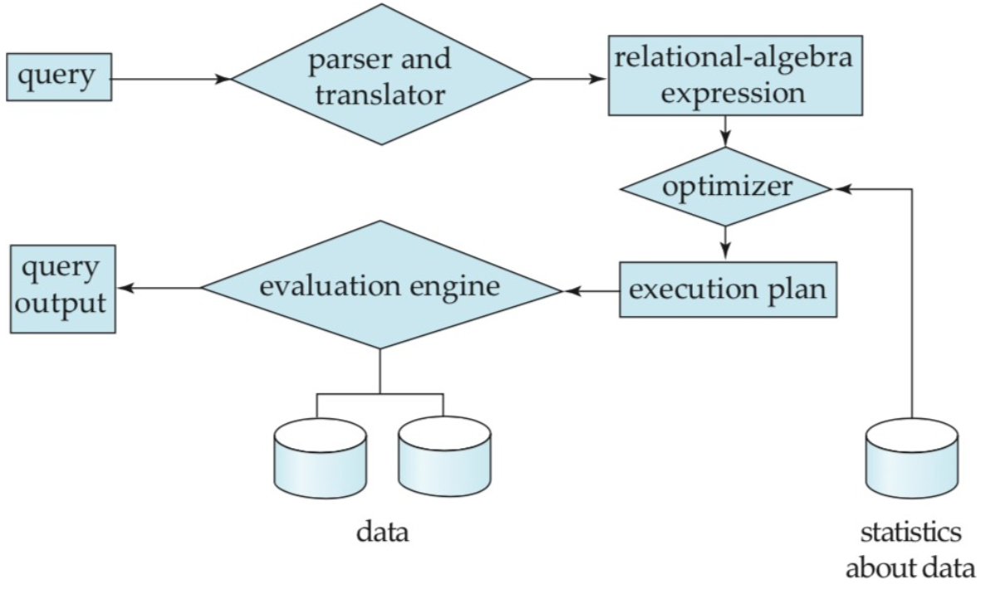
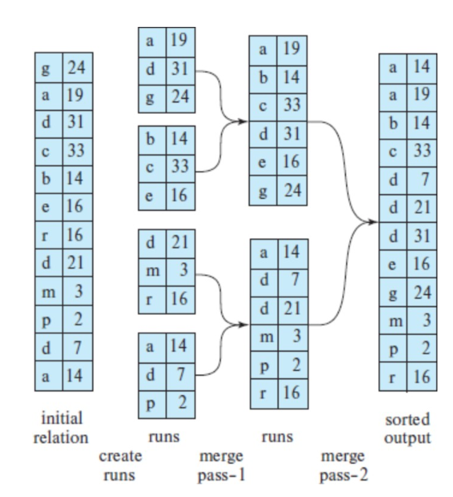
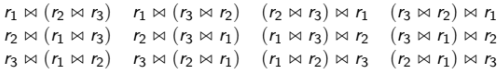

# Lecture 11 - Query Processing and Optimization 5/13/19

## Query Processing

* Query processing takes a SQL query and converts it into a higher
    order language understood by the RDBMS (Relational Algebra)
* Query Processing results in expressions that can be used at the physical level of the
    file system, and a variety of optimizations
* First the parser checks the syntax of the query and verfies all the relation names
* The system then constructs a parse-tree of the query which translates to a relational
    algebra expression
* Several different queries may lead to the exact same resultset, and one query can also
    be represented by multiple relational algebra expressions
* For example, this query:

    ```sql
    SELECT user_id
    FROM bird_monthly_bill
    WHERE amount > 1000;
    ```
    can be represented as
    \begin{equation}
    \sigma_{amount>1000}(\Pi_{user\_id, amount}(bird\_monthly\_bill))
    \end{equation}
    and
    \begin{equation}
    \Pi_{user\_id, amount}(\sigma_{amount>1000}(bird\_monthly\_bill))
    \end{equation}
* The relational-algebra representation of a query only specifies partially how to
    evaluate a query
* To fully specify how to evaluate a query, the expression needs to be annotated with
    instructions specifying how to evaluate each operation
* The next step for the optimizer is to pick the most efficient query plan, which
    requires knowledge in the cost of each operation

{ width=50% }

* Things that the optimizer must account for is disk accesses, CPU time to execute a
    query, and in distributed systems, the cost of communication (Network I/O)
* Two important peices of data for this are the number of blocks transferred from disk
    and the number of random I/O accesses

#### Implementing the Select $\sigma$ Operator

* `SELECT` is similar to `WHERE`, since to find the rows that match the `SELECT`, a
    linear scan must be done with a naive approach
* What if there `WHERE` clause contains the primary key, by definition only one record
    can match
* If everything is implemented with a B+ tree, then to find a record by equality, we have
    to search the tree, note that less than 1% of nodes are internal in a B+ tree

#### Sorting

* There are two important uses of sorting:
    1. The user can specify an `ORDER BY`
    2. Certain relational operators such as `JOIN` can be implemented more efficiently
* The common out-of-core sorting mechanism used in RDBMS is External Sort-Merge, or
    Two-Pass Multiway Mergesort, which allow for sorting relations larger than what can
    fit in memory
* To sort, first divide the relation into chunks of $M$ blocks, then sort each chunk
    individually, then in RAM, set asside $M-1$ buffers for input, and 1 buffer for the
    eventual output to disk. Fill each of those buffers with B elements from their
    correspoding buffer, then merge the $M-1$ buffers and fill the last remaining buffer
    * Note that each entry that was copied to the output block buffer is then
        deleted from the input.
    * When the output buffer block fills up, it is written to the final result.
    * When an input buffer is empty, we read another B records from the corresponding
        input file.

{ width=30% }

#### Join Operations $\bowtie_{\theta}$

* There are several main `JOIN` algorithms
    * Nested-Loop Join
    * Merge Joins
    * Hash Join
    * Map and Reduce-Side Joins
    * Shuffle Hash Join
    * Broadcast Hash Join
* **Nested Loop Join**
    * This is the simplest for computing $R \bowtie_{\theta} S$
    * This is essentially a nested for loop that compares every record $R$ to every
        record in $S$, this runs in $\mathcal{O}(n^2)$ complexity with $n=\max(n_r, n_s)$
    * Some advantages are there is no need for an index, and there are no restrictions on
        $\theta$, but this comes at the cost of speed
    * Ideally, one relation can fit in RAM, then we can leave that permanently cached for
        the nested loop while the othere relation can be loaded in from disk
    * If this isn't the case, each relation is broken up into blocks, then every block
        $B_r$ is compared to every block $B_s$
    * If neither relation fits in main memory, it’s best to use the smaller
        relation as the outer relation.
    * This can be sped up with the two following tricks:
        * If the join key itself is a primary key, we can stop the matching
            process as soon as a match is found.
        * When a nested loop is finished, we can then work backwards on the inner
            relation that way we reduce disk seeks
        * Can even create a temporary index on the inner relation if it isn't too costly
            to replace file-scans with index lookups
* **Merge Join $\textbf{R} \bowtie \textbf{S}$**
    * Let $r(R)$ and $s(S)$ represent the relations we want to join, and $R \cap S$ their
        common attributes, then both relations are sorted along $R \cap S$
    * If the tables have been sorted by the join attribute, we only need to scan each
        table only once.
    * During the merge join operation, tuples are implicitly partitioned by key value.
    * If tuples do not fit in RAM for certain values of the join key, we can
        use a block nested join loop instead.
* **Hash Join**
    * We can partition the tuples of both relations R and S by hash value since we know
        that if $h$ is a hash function and $t_r \in R$ and $t_s \in S$ and the join key
        $K$ such that $K(t_r) = K(t_s)$, then $h(K(t_r)) = h(K(t_s))$
    * Let $r_i$ and $s_i$ be sets of tuples that all share the same join key hash, then
        for all i, tuples $r_i$ are only compared to tuples in $s_i$
    * Hash joins can be used to improve the efficiency of the indexed
        nested-loop join.
    * If the relations are very large so that each relation is in a different node, then
        we can use a hash join with a Bloom Filter, so the hash of the key for each tuple
        in one relation is computed and added to the Bloom Filter
    * Since several hash functions are used for the Bloom Filter, there are a lot of
        collisions and thus the space required is small
    * This small Bloom Filter can then be easily sent over the network to the machine
        containing the other relation.
    * Then each key value in the other relation is checked, if the key does not exist in the
        Bloom Filter, we can throw out the tuple.
    * Only the tuples that the Bloom Filter thinks match on the join key are then sent to
        some machine to perform the actual join.
* **Joins in Spark**
    * Spark implements all these join algorithms on a distributed scale
    * The **shuffle hash join** (old default of Spark) shuffles tuples across the network so that
        all tuples with the same key value end up on the same node.
    * **Sort merge join** is more robust and faster than shuffle hash join and is the new
        default of Spark, this is similar to merge join in a RDBMS, except the algorithm is
        performed independently on each partition of data to prevent shuffling of data
        across the network. Data is transmitted over the network once if it must be relocated.

#### Other Set Operations

* For $L \cup R$, build a hash index $I_i$ in RAM, where $I_i$ is a specific hash
    partition, then add the tuples in $r_i$ to the hash index only if not already in the
    index, then add the hash index tuples to the result
* For $L \cap R$, again build a hash index $I_i$, then for each tuple in $r_i$, probe
    the hash index and output the tuple if it is already present in the hash index.
* For $L - R$, again, build a hash index $I_i$, Then probe the hash index and if the
    tuple is present in an index, delete it. Once this is done return whats left
* Aggregations is implemented the same way as duplicate detextion, The tables are sorted
    or hashed except on join attributes, instead of removing duplicates, we apply some
    function to them

## Query Optimization

* Golden Rule: Before doing an inner join: **filter**
* Given an expression in relational algebra, the query optimizer develops a query-execution
    plan that computes the same result as the relational algebra and also that is the
    least costly
* There are three steps to this process:
    1. Generating several equivalent relational algebra expressions
    2. Annotating the expressions with indices and statistics.
    3. Estimating the cost of each plan and then picking the one with the lowest cost

#### Step 1: Generating Equivalent Relational Algebra Expressions

* Two relational algebra expressions are equivalent if and only if on
    every legal database instance, both expressions generate the same
    set of tuples.
* Let $E_i$ Be A Relation, $L_i$ A List Of Attributes And $\theta_i$ Be A Set Of
    predicates
* Which one is faster?
    \begin{equation}
    \sigma_{\theta_1 \vee \theta_2}(E) = \sigma_{\theta_1}(\sigma_{\theta_2})
    \end{equation}
* These equivalence rules and join guidance are used to transform
    some relational algebra expression $E$ to equivalent expression $E^{\prime}$ in
    some set of equivalent expressions $EQ$.
* If $E$ matches some equivalent rule $R$, we transform it to an equivalent expression
    $E^{\prime} R(E)$, then update $EQ = EQ \cup E^{\prime}$
* If we have $E^{\prime}$ for some $E$ by applying an equivalence rule to some subquery $e$,
    then we know the rest of $E$ and $E^{\prime}$ are identical
* The optimizer does not always need to generate all expressions. If the
    optimizer can estimate the cost associated with the plan that a particular
    generated expression will incur, we can prune it from the search.

#### Step 2: Estimating Statistics of Expressions

* The query optimizer does not know how large each table is without
    statistics about each table. The most basic statistic is the number
    of rows in the table.
* These statistics are based on samples, and are not updated
    on each mutation of the data.
* RDBMS usually catalog the number of tuples per relation, the number of blocks used to
    store a table, the size of a tuple for some relation (bytes), the number of rows that
    fit in one block, and the number of distinct values that appear in any relation by
    attribute
* In other databases, we can compute the statistics on tables with:

    ```sql
    -- DB2
    RUNSTATS ON TABLE <userid>.<table> AND INDEXES ALL

    -- Oracle
    RUNSTATS ON TABLE <userid>.<table> AND INDEXES ALL
    ```
* A lot of statistics and information is available in views named
    `pg_stat*` database in PostgreSQL.

#### Step 3: Choice of Evaluation Plan

* So we now have a large tree of possible evaluation plans based on
    equivalent relational algebra expressions as well as their costs based
    on statistics.
* An evaluation plan defines which algorithm should be used for each
    operation, and how the operations should coordinated
* The typical average query is a basic `SELECT ... FROM ... WHERE`, with 1-3 joins 
* A reasonable assumption is that join order domiates cost. Suppose there are 3
    relations, then the possible join orders are:

    { width=80% }
* With n relations, the number of different join orders is:
    \begin{equation}
    \frac{[2(n-1)]!}{(n-1)!}
    \end{equation}
* However, this can be reduced with dynamic programming by grouping together optimal join
    groups
* In bid data frameworks like Spark, it may be important to optimize your own queries
* There are also a few other heuristics for performing optimizations:
    1. Perform `SELECT` (`\sigma`) operations as early as possible, this reduces the size
       of intermediate results
    2. Perform projections (`\Pi`) early, since this reduces the amount of attributes
       passed around
    3. Cache queries that we use often
