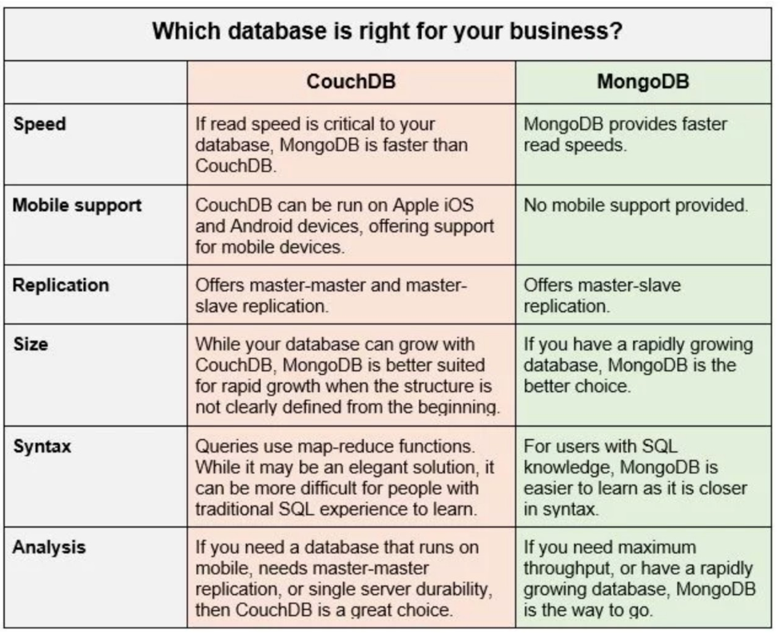

# Lecture 16 - NOSQL 2019-06-04

## NOSQL

* The most common models used for NoSQL are
    1. Document store (MongoDB, CouchDB)
    2. Graph (Neo4j, OrientDB, Giraph)
    3. Key-value store (Redis, Memcached)
    4. Columnar (Cassandra, HBase, DynamoDB)
* CAP Theorem (Brewer’s theorem): impossible for a distributed data store to
    simulatenously provide more than two of the following guarantees:
    1. **Consistency**: Every read receives the most recent write, or an error is thrown.
    2. **Availability**: Every request receives some kind of response (not an error),
        without guaranteeing the most recent write. It always returns a response.
    3. Partition tolerance: The system continues to function even if messages
        are lost or are delayed by the network between or among nodes
* Sharding just means that we treat groups of rows as one unit and distribute them across
    the network to different data nodes potentially running different instances of the
    RDBMS.
* Once a shard is determined, it is independent of every other shard in the system.
* The problem with sharding is the increased latency and consistency and durability
    issues due to the distributed nature of the system, as well as the more complicated
    SQL required to handle this type of querying

#### MongoDB

* It is a document store which means that it ingests full documents into a JSON-like
    schema and allows querying on this schema.
* All NoSQL databases have tradeoffs different compared to the relational model.
* **Indexing**: Supports both primary and secondary indices, but not a B+tree only
    B-trees. Data are nested natively via JSON.
* **Ad Hoc Querying**: on field, range and regular expression, and can also include
    JavaScript.
* **Aggregation**: is supported like in SQL, but uses MapReduce to distribute
    embarrassingly parallel computations.
* **ACID Transactions**: are supported as of v4.0 and uses snapshot isolation rather
    than locks.
* **Data Format**: Data is basically just a big JSON blob with no particular format or
    schema on disk.
* **File Storage**: MongoDB can be "turned inside out" and used as a file system called
    GridFS.
* MongoDB ensures high availability by using replica sets, which are similar to data
    snapshots
* If the primary replica fails, an election process is conducted to determine which
    secondary should be the primary. Secondaries can also be used for high available
    reads.
* In MongoDB, if multiple documents are included in a write operation each document write
    is atomic, even if that document contains embedded documents, but the multi-document
    update itself is not atomic.
* An ODM (or ORM for RDBMS) is an API that allows users to use regular function calls
    to perform database inserts, updates, deletes and retrievals.
* OxMs generally support CRUD operations:
    1. **C**reate
    2. **R**ead
    3. **U**pdated
    4. **D**elete
* Using SQL or whatever DML the database supports directly will yield the best
    performance.
* Using an ODM or ORM does induce a small performance hit, but allows tighter integration
    into applications and is usually easier to maintain.
* Connecting Mongoose to MongoDB

    ```javascript
    //Import the mongoose module
    var mongoose = require('mongoose');

    //Set up default mongoose connection
    var mongoDB = 'mongodb://127.0.0.1/my_database';
    mongoose.connect(mongoDB, { useNewUrlParser: true });

    //Get the default connection
    var db = mongoose.connection;

    //Bind connection to error event (to get notification of
    // connection errors)
    db.on('error', console.error.bind(console,
    'MongoDB connection error:'));
    ```
* We first tell Mongoose about the MongoDB schema of a document collection using the
    Schema object and then compile it into a model.

    ```javascript
    // Define schema
    var SomeModelSchema = new Schema(
    {
        name: String,
        binary: Buffer,
        living: Boolean,
        updated: { type: Date, default: Date.now() },
        age: { type: Number, min: 18, max: 65, required: true },
        mixed: Schema.Types.Mixed, // arbitrary type
        _someId: Schema.Types.ObjectId, // unique object ID
        array: [], // empty array of unknown type
        ofString: [String], // array of type String
        // You can also have an array of each of the other types too.
        nested: { stuff: { type: String, lowercase: true, trim: true } }
    })

    // Compile model from schema
    var SomeModel = mongoose.model('SomeModel', SomeModelSchema );
    ```
* MongoDB also allows for the addition of **Validators**

    ```javascript
    var breakfastSchema = new Schema({
        eggs: {
            type: Number,
            min: [6, 'Too few eggs'],
            max: 12,
            required: [true, 'Why no eggs?']
        },
        drink: {
            type: String,
            enum: ['Coffee', 'Tea', 'Water',]
        }
    });
    ```
* Mongoose also supports **virtuals**. These are synthetic fields that
    are not persisted in MongoDB but are used for string formatting
    and other front end uses. They are similar to `struct`
* The model is a constructor that takes a schema definition constructs documents.
* CRUD operations are asynchronous, so you can write inserts like this:

    ```javaScript
    SomeModel.create({ name: 'also_awesome', age: 20 },
        function (err, awesome_instance) {
            if (err) return handleError(err);
            // saved!
    });
    ```
* To retrieve records with Mongoose:

    ```javascript
    var Athlete = mongoose.model('Athlete', yourSchema);

    // find all athletes who play tennis, selecting the 'name'
    // and 'age' fields
    Athlete.find({ 'sport': 'Tennis' }, 'name age',
        function (err, athletes) {
            if (err) return handleError(err);
            // 'athletes' contains the list of athletes that match the criteria.
    })
    ```
* MongoDB vs. CouchDB
    * CouchDB is another similar object store.
    * MongoDB uses a variant of JSON called BSON whereas CouchDB uses JSON.
    * MongoDB is truly schema-free whereas CouchDB conforms more to the document store
        model with structure
    * MongoDB allows strong consistency and expressive query language
    * MongoDB supports indexes natively (primary and secondary, B-tree), whereas CouchDB
        uses views as an index insteadD
    * CouchDB treats data as documents consisting of fields and attachments
    * CouchDB uses optimistic updates and lockless
    * CouchDB uses a REST API whereas MongoDB uses uses an ODB called Mongoose.
    * Both use MapReduce. MongoDB uses it for querying, CouchDB generates a key and value
        right after the document is created and is immutable unless the document changes.
    * Both use similar clustering methods,

{ width=35% }
