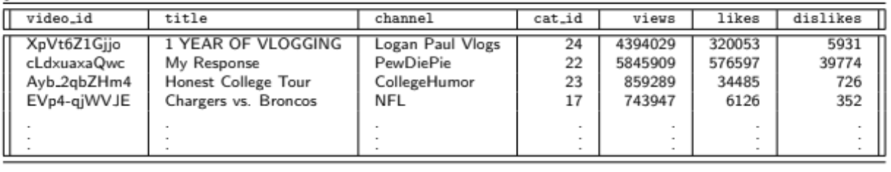
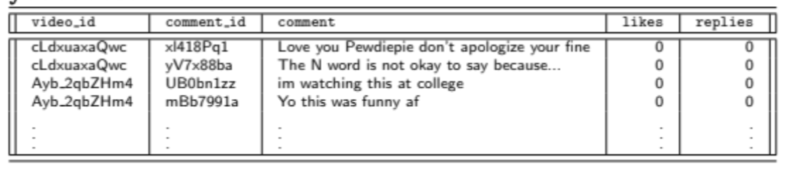
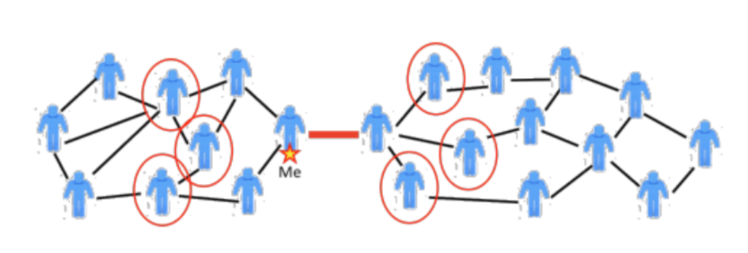
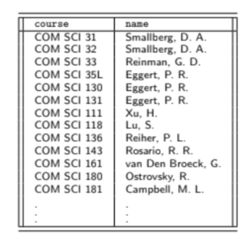

## Lecture 2 - Relational Algebra - 4/7/19

Relational algebra is a semantic system used for modeling
the operations on relational data developed by Edgar F. Codd at IBM

For the following examples, we will use the following data:

{ width=50% }

{ width=50% }


### Select $\sigma$

1. Select retrieves a subsete of tuples from a single relation that
    satisfies a particular constraint and returns a new relation
    that is a subset of the original version.
    * In relational algebra, $\sigma_\psi$ retrieves a set of tuples
        that meet condition $\psi$.
    * Alternatively:
        \begin{equation}
        \sigma{}_\psi{}(R) = \{t\in{}R:\psi{}(t)\}
        \end{equation}
    * Predicates appear in a subscript of $\sigma$ and contain boolean expressions
    * If we want all videos that have been viewed over 1 million times, we can
        write this as:
        \begin{equation}
        \sigma{}_\mathrm{views>100000}(youtube\_video)
        \end{equation}
    * We can also use more complex predicates using conjunction/disjunction
    * We user ¬ to represent to specify the logical not operator.
    * An Example of select as a SQL implementation:

        ```sql
        SELECT title
        FROM youtube_videos
        WHERE likes > dislikes
        AND views > 1000000
        AND cat_id = 24
        ```
    * This can be written in relational algebra as:
        \begin{equation}
        \sigma{}_\mathrm{likes>dislikes\wedge{}views>1000000\wedge{}cat\_id=24}(youtube\_videos)
        \end{equation}
    * **Note**: the select operator extracts tuples not in attributes
    * **Note**: $\sigma$ refers to `SQL WHERE` clause, not `SELECT`
2. Projection $\Pi$
    * It extracts attributes from a set of tuples
    * Given a relation R and an arbitrary tuple t and a subset of attributes $a_1 ... a_n$
        \begin{equation}
        \Pi{}_\mathrm{a_1, ... , a_n}(R) = \{t[a_1, ... , a_n]:t\in{}R\}
        \end{equation}
    * The projection is typically the last (outermost) operation done on a relation
    * Projection can be generalized to:
        1. Use functions like `MAX, MIN, COUNT` (Ex: $\Pi_\mathrm{AVG(likes)}(R)$)
        2. Create new attributes or rename attributes using $\to$a notation
            * Ex: of combining columns to make a new one
                $\Pi{}_\mathrm{likes+dislikes\to{}interactions}$
    * The projection operator removes duplicates, making it similar to `SELECT DISTINCT`
3. Combining $\sigma$ and $\Pi$
    * Can construct a projection from the `SELECT` clause then:
        \begin{equation}
        \Pi{}_\mathrm{title, channel}(\sigma{}_\mathrm{(likes>dislikes)\wedge{}
        (views > 1000000)}(youtube\_video))
        \end{equation}
    * **Note**: conjunctions can be written as a chaining of multiple sets:
        \begin{equation}
        \Pi{}_g(\sigma{}_\mathrm{f(a_1)}(...\sigma{}_\mathrm{f(a_n)}(R))) =
        \Pi{}_g(\sigma{}_\mathrm{f(a_1)\wedge{}...\wedge{}f(a_n)}(R))
        \end{equation}
4. Cartesian Product x
    * The cartesian product combines tuples from two relations, in all possible combinations
    * This can formally be written as:
        \begin{equation}
        A \times{} B = \{(a,b):a\in{}A,b\in{}B\}
        \end{equation}
    * If two relations, $R_1, R_2$ have attribute nums $n_1, n_2$ then
        \begin{equation}
        \|R_1 \times{} R_2\| = n_1n_2
        \end{equation}
    * Cartesian products are thus an $O(n^2)$ operation where $n = max(n_1, n_2)$
    * Cartesian products are the first step towards the `JOIN` operation
5. Cartesian Product and the Theta Join $\bowtie{}_\theta{}$
    * A **join** combines tuples from relation $R_1$, with tuples from another relation
        $R_2$ in some strucured way using a constraint
    * This constraint $\theta$, determines how tuples from both relations will be combined
        \begin{equation}
        \bowtie{}_\theta{} = \sigma{}_\theta{}(R_1 \times{} R_2)
        \end{equation}
    * If $\theta$ consists of only equality constraints, this is called an equijoin. This
        is also known as an **inner join**
6. F, FOAF, FOAFOAF?
    * What if you wanted to identify all friend of a friend (of a friend) relationships,

        { width=50% }

    * To form this relation, take the cartesian product of R with itself. (Note: must rename
        one of the relations in order to rpoceed)
        * To denote this, let $\rho{}_X(E)$ be an operator the renames an operation from E to X
    * Now the above relation can be represented as:
        \begin{equation}
        \Pi{}_\mathrm{L.user\_id, R.friend\_user\_id}
        (\sigma{}_\mathrm{L.friend\_user\_id = R.user\_id\wedge{}L.user\_id\neq{}R.friend\_user\_id}
        (\rho{}_L(R) \times{} R))
        \end{equation}
7. Natural Join $\bowtie$
    * In relational algebra, the **natural join** allows us to join two relations together based
    on equality, using common attribute name
    * The natural join simply joins allow common attributes
    * This expression:
        \begin{equation}
        \Pi{}_\mathrm{course, name}(instructor \bowtie teacher)
        \end{equation}
    * Returns the following:

        { width=40% }

    * Unlike theta join, do not nead to alias attributes since the natural join knows which
        attributes to use as the join key
    * If you try to join $R \bowtie{} S$, but R and S have no common attributes, this will
        just return the cartesian product $R \times{} S$
    * Natural Joins are associative, so
        \begin{equation}
        (R \bowtie{} s) \bowtie{} T = R \bowtie (S \bowtie{} T)
        \end{equation}
8. Set Union $\cup$
    * The set union is a concatination of two sets of tuples that have the same structure
    * We can compute the set union between two relations, or between subsets of a single
        relation;
    * In the Youtube example, if we wanted to join both relations and extract the title,
        we could do something like:

        ```sql
        SELECT title
        FROM youtube_videos_us
        UNION
        SELECT title
        FROM youtube_videos_gb
        ```
    * This query can also be represented as:
        \begin{equation}
        \Pi{}_\mathrm{title}(R\cup{}S) = \Pi{}_\mathrm{title}(R) \cup \Pi{}_\mathrm{title}(S)
        \end{equation}
    * Note that both sets of tuples have the same schema, otherwise this is illegal
    * The union of these relations is one relation, containing all the tuples of the US location
        and all the tuples in the UK location
    * In general, performing a set union of tuples requires that the sets are compatible. This
        means that
        * $\|A\| = \|B\|$ (Same lengths)
        * $\forall a_i \in A, \forall b_i \in B, Dom(a_i) = Dom(b_i) \forall i$ (same domain)
    * Note that disjunctions can be written as
        \begin{equation}
        \Pi{}_g(\sigma{}_\mathrm{f(a_1) \vee ... \vee f(a_n)}(R)) =
        \Pi{}_g(\sigma{}_\mathrm{f(a_1)}(R)) \cup ... \cup \Pi{}_g(\sigma_\mathrm{f(a_n)}(R))
        \end{equation}
9. Set Difference -
    * The set difference operator takes in elements that are in the left relation but
        not the right relation
        \begin{equation}
        R - S = \{x \in R:x \notin S\}
        \end{equation}
    * For example, if you want to retrieve only videos that have 500k - 1 million views,
        you can have the following expression:
        \begin{equation}
        \Pi{}_\mathrm{video\_id}(\sigma{}_\mathrm{views \leqslant 1000000}(youtube\_video)) -
        \Pi{}_\mathrm{video\_id}(\sigma{}_\mathrm{views < 500000}(youtube\_video))
        \end{equation}
    * Which is equivalent to:
        \begin{equation}
        \Pi{}_\mathrm{video\_id}(\sigma{}_\mathrm{views \geqslant 500000 \wedge views
        \leqslant 1000000}(youtube\_video))
        \end{equation}
10. Set Intersection $\cap$
    * The intersection of tuples is the subset of tuples that appears in both sets
        \begin{equation}
        S \cap T = \{ x : x \in S, x \in T\}
        \end{equation}
    * Note that set intersection is redundant because
        \begin{equation}
        R \cap T = R - (R - S)
        \end{equation}
11. Rename $\rho$
    * Rename was introduced earlier, but note that you can also rename all its attributes
        at the same time
        \begin{equation}
        \rho{}_\mathrm{X(A_1,A_2, ... , A_n)}(E)
        \end{equation}
    * This statement says "rename relation E to X with attribute names given by $A_1, ... , A_n$"
12. Aggregation
    * Can represent aggregations on attributes using $\gamma$
    * Aggregations are functions applied to groups of tuples in a relation to summarize them
    * Examples include `SUM, AVG, MIN, MAX, DISTINCT-COUNT`
    * Example if you want average number of comment likes per video in youtube_comment
        \begin{equation}
        {}_\mathrm{video\_id}\gamma{}_\mathrm{AVG(likes)}(youtube\_comment)
        \end{equation}
    * Aggregates are specified as a subscript on the left of the operator
    * Formally, can aggregate multiple attributes simultaneosly and apply aggregation functions
        $F_i$ to each attribute $A_i$
        \begin{equation}
        {}_\mathrm{G_1,G_2,...,G_n}\gamma{}_\mathrm{F_1(A_1),F_2(A_2),...,F_n(A_n)}
        \end{equation}
13. Relational Algebra vs SQL
    * One difference is that in relational algebra, we dealt with tuples, which will always be 
        unique, this is not the case for SQL 
    * A more realistic way is with multisets since multisets of tuples can contain duplicates

