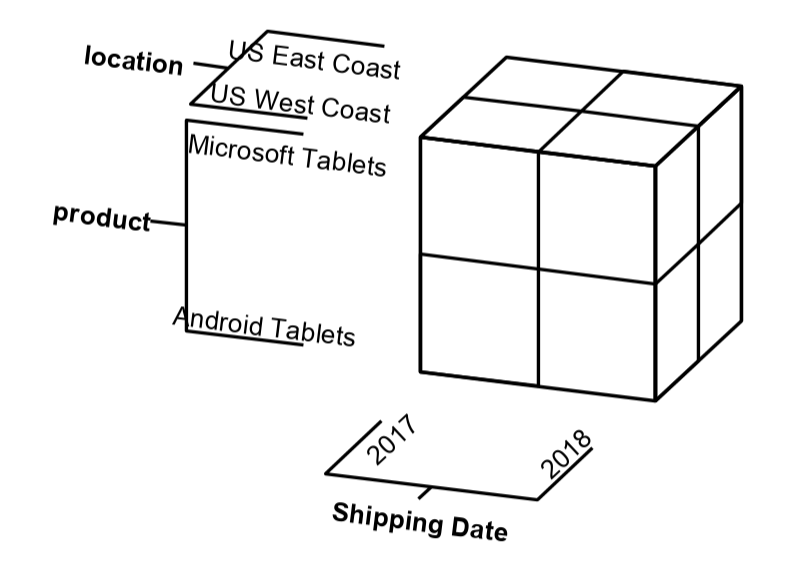
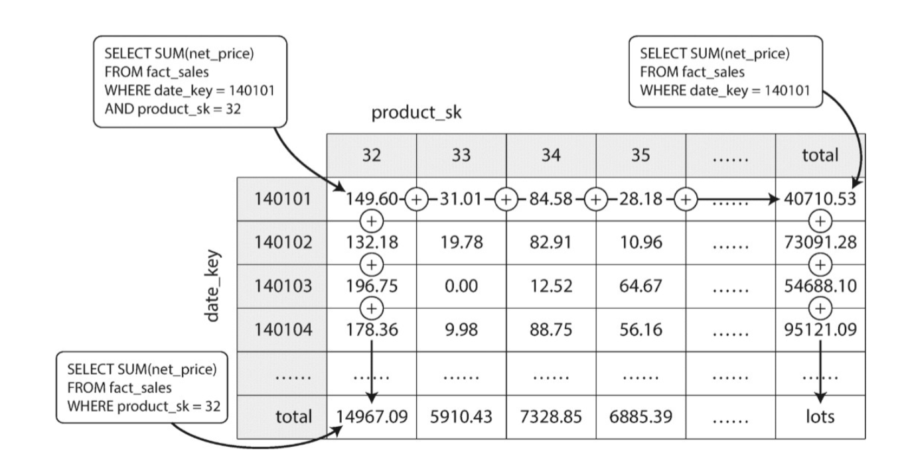
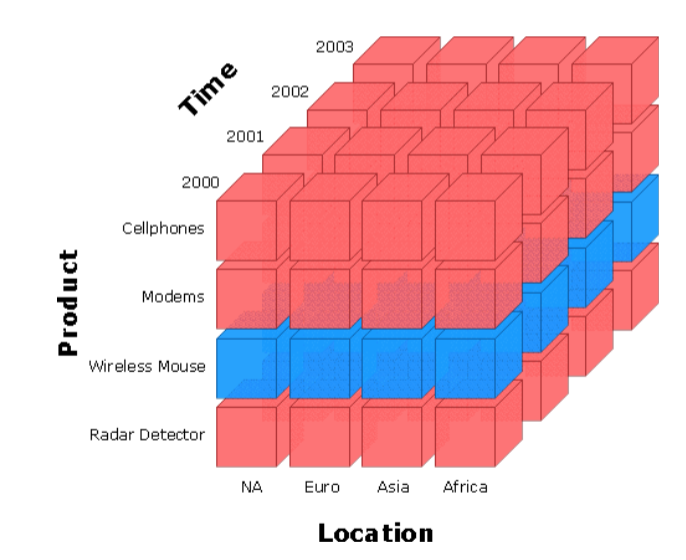
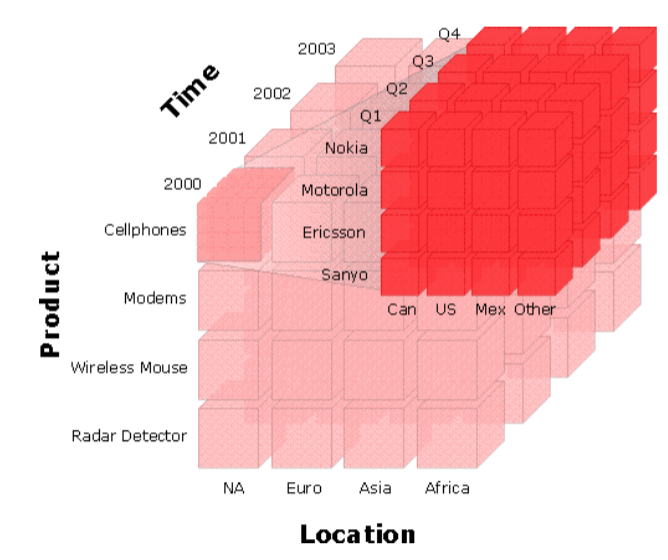
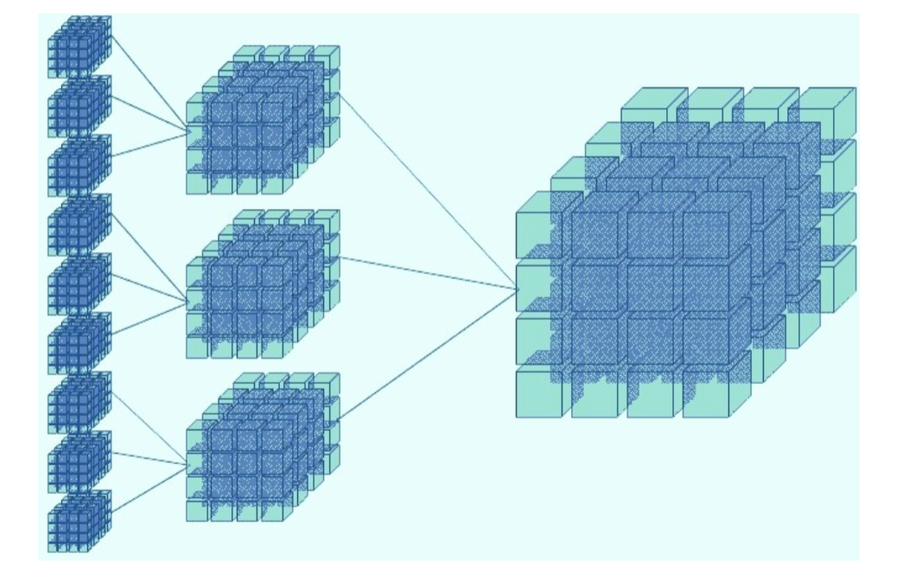
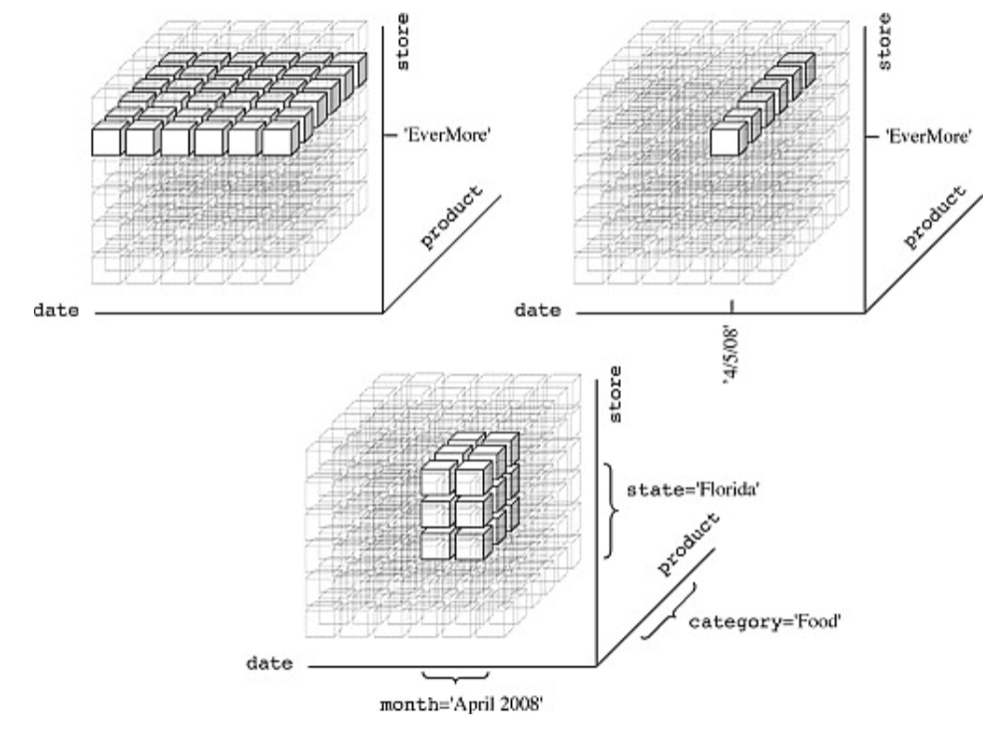
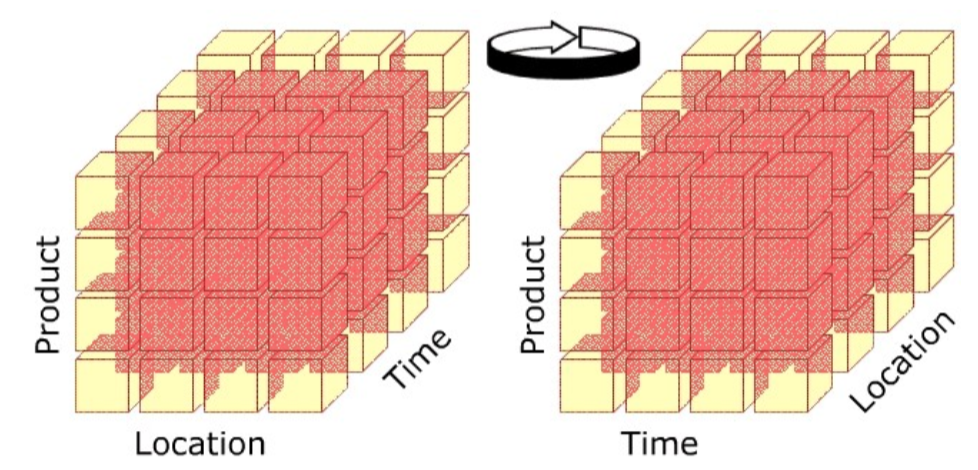
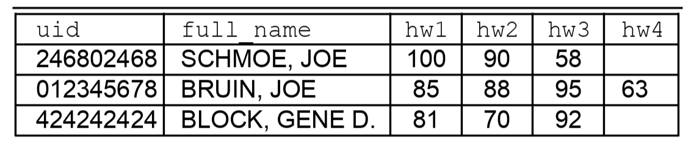
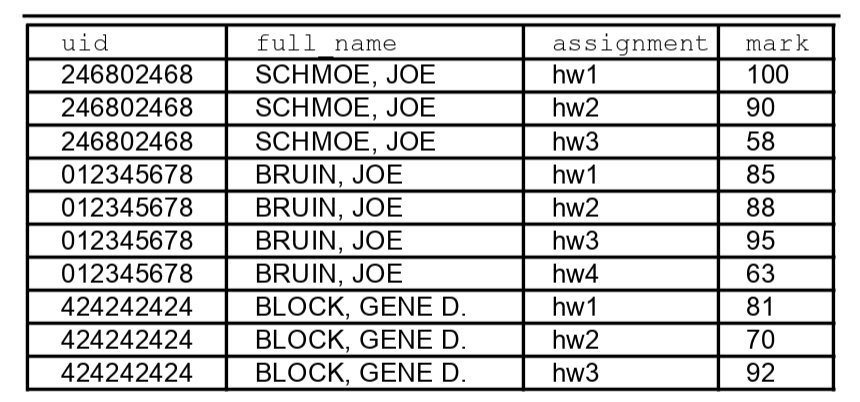

## Lecture 7 - OLTP and Data Warehousing - 4/22/19

## OLTP

1. A relational database treats data as a 2-dimensional figure – a
   table. Rows correspond to records/tuples, and columns correspond
   to attributes.
2. Relational databases use seperation of concerns to divide data into individual tables.
   These tables must be joined together to exploit the relationships among data.
3. This separation of concerns reduces redundancy in data storage
4. The RDBMS optimizes for many random writes and reads.
5. Each one of these reads and writes is a result of a transaction, because of this, an
   RDBMS is an Online Transaction Processing System (OLTP)

## OLAP (Online Analytical Processing)

1. OLAP, and Data Warehouses, are used for analytics only, and not
    for production systems. OLAP is multidimensional, rather than
    relational, but data may still look similar to a table to the user.
2. In OLAP, data is conceptualized as a hypercube to represent its multidimensional nature

    { width=50% }

3. Another analogy for OLAP data is that they can be stored as tensors
4. OLAP is optimized for storing aggregates rather than raw data.
5. The user specifies two things to build an OLPA cube
    * The individual dimensions to analyze
    * aggregation functions to apply on each combination of dimensions.
6. Each time the data in the system is updated, the system
   computes all combinations of dimensions in the cube, offline,
   and applies the aggregation functions across each group.
7. The total number of combinations is given by
    \begin{equation}
    \sum_{k=1}^{n} {n \choose k} = 2^n - 1
    \end{equation}

8. This is essentially like a `GROUP BY` but on every possible combination of columns
9. Typically data in OLAP is updated at a set schedule, usually overnight, since
   recomputing aggregations is very intensive process
10. OLAP makes heavy use of caching – aggregates across dimensions and their intersections
    are cached for quick access.
11. The main differences between OLAP and OLTP
    * OLAP cubes take a long time to process (very high latency);
    * Reads of aggregates are very fast (very low latency);
    * Data is likely to be out-of-date.
    * Typically append-only – no modifications or deletions
    * Read-only to users
    * For analytics, that’s usually OK because we typically only look
      at full periods (i.e. full days).
12. During a down period, en ETL Job is executed against the OLTP/RDBMS and pulls the current
    state of the database, does some possible transformation to it, and
    then loads it into the data warehouse. The steps followed are:
    * **Extract**: Pull data from some source, usually an RDBMS.
    * **Transform**: Perform some transformation on the data, such as type casting,
        de-duplication, or processing JSON
    * **Load**: Write the raw data to the data warehouse. Under OLAP, aggregates
        will be computed.
13. Usually, an ETL job will run against a replicate of the RDBMS rather than the
    production database, since if you run the ETL on the already strained database, it
    will be very inefficient
14. Can also view the OLAP data as a 2d table:

    { width=50% }

15. By pre-computing all the dimensions, there is some advanced OLAP operations that we
    can perform easily:
    * **Slicing**: selects one particular dimension from a cube and returns the sub-cube

        { width=35% }

    * **Dicing**: slicing for multiple dimensions

        { width=35% }

    * **Rollup**: creates aggregates on dimensions, including up a hierarchy,

        { width=35% }

    * **Drill Down**: is the opposite of rollup - given an aggregates we can display more
        fine aggregates for more specific dimensions

        { width=35% }

    * **Pivot**: rotates data between two different formats: long and wide

        { width=35% }

16. Note that OLAP is a set of operations we can do on that data
17. Many data warehouses now use a column-oriented model rather than relational
    or OLAP cube. Since we want something that can across across a column
    quickly, rather than scanning across rows quickly.
18. Data warehouse systems are often denormalized to allow quick access to
    important information.

#### Two Common Data Formats: Long and Wide

1. Suppose we have a homework_grades table: each student has multiple grades,
   one for each homework assignment.
2. The first format is wide; it involves multiple columns, one per homework in
   this case, and one row per student.

   { width=50% }

3. The second format is long; it involves multiple rows per unit. In the case
   of homework_grades, multiple rows per student.

    { width=50% }

4. The long format is not the most intuitive, but it has several advantages
    * We do not need to know a priori how many homework assignments there will be
    * Assigning another homework is as simple as inserting a new row for
        each student.
    * Removes redundancy, there is no `NULL` for students who didn't turn in their
        homework
5. For storage, Long format is more preferable, since it provides better flexibility,
   and efficiency (Faster to use more rows than more columns)
6. Converting between long and wide format, particularly long to wide, is called pivoting.

#### Pivoting

1. OLAP systems and Data Warehouses support pivoting natively with the PIVOT keyword.
   RDBMS do not, PostgreSQL exposes it via an extension called tablefunc with the crosstab
2. Here is an example of convering the homework_grades table to a wide from long:

    ```sql
    SELECT
        uid, full_name,
        SUM(CASE assignment WHEN 'hw1' THEN mark ELSE 0 END) AS hw1,
        SUM(CASE assignment WHEN 'hw2' THEN mark ELSE 0 END) AS hw2,
        SUM(CASE assignment WHEN 'hw3' THEN mark ELSE 0 END) AS hw3,
        SUM(CASE assignment WHEN 'hw4' THEN mark ELSE 0 END) AS hw4
    FROM homework_grades
    GROUP BY uid, full_name;
    ```
   There are 4 `CASE` statements, each one generates a new

#### Rollup Tables

1. We have used `GROUP BY` extensively, a rollup is more sophisticated, it provides
   aggregates across all levels of the heirarchy. An example for the hw table is:
    * Average midterm score by TA, section, by number of lectures attended;
    * Average midterm score by TA and section; average midterm score by TA;
    * Average midterm score for entire lecture
2. In PostgreSQL, we can add a ROLLUP to a GROUP BY that allows us to compute aggregations, 
   and then adds another row
    
    ```sql
    SELECT
        ta,
        AVG(points) as ta_average 
    FROM midterm_grades
    GROUP BY ROLLUP(ta);
    ```

#### Overview of OLAP

1. Series of data operations designed for fast analytics
2. Data is multidimensional and dimensions and their interactions are pre-computed
3. Use some redundancy to improve querying times for fast analytics.
4. Difference between OLAP and OLTP is that OLAP is for fast analytics while OLTP is
   designed for short transactional writes and updates.
