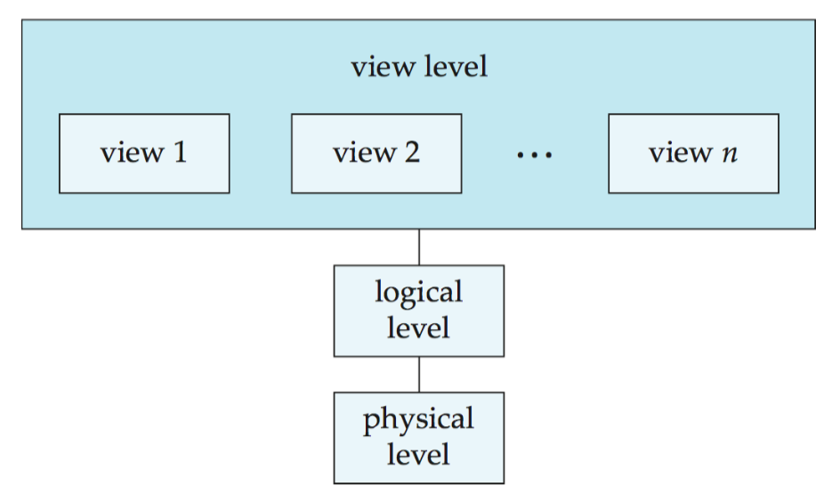
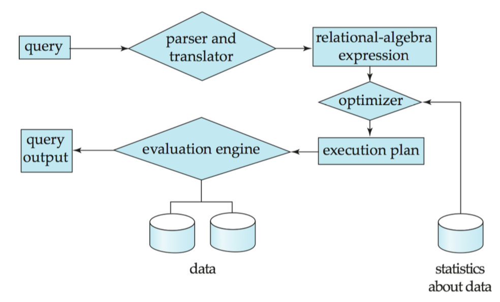
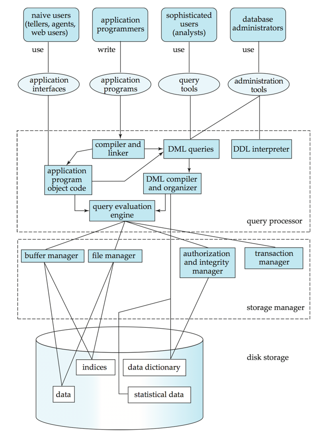

## Reading 1 - 4/06/2019


### Chapter 1 - Introduction (Database System Concepts)


#### Database Management Systems

1. DBMS contain information about a particular enterprise
    * Contains collection of data and an api to access them
2. Drawbacks of file systems for storing data
    * Data redundancy - multiple file formats, duplication in different files
    * Difficulty query needs its own program
    * Data Isolation - caused by multiple files and formats
    * Integrity Problem
        * Constraints are buried under program code
        * Hard to add new constraints or change existing ones
    * Atomicy of Updates
        * Failures may leave database inconsistent
        * Concurrent access by multiple users can be very problematic
            due to lack of protections
    * Security Problems - Hard to provide users access to some data but not all
3. Levels of Abstraction
    1. Physical Level: describes how record is stored
    2. Logical Level: describes data stored in database, and relationships among data
    3. View Level: application programs hide details of data types.

        { width=50% }

4. Instances and Schema
    * Logical Schema - The overall architecture
    * Physical Schema - The overall physical structure of the database
    * Instance - Actual content of database at a certain point in time
    * Physical Data Dependence - Ability to modify physical schema without
        changing the logical schema
5. Relational Model
    * All the data is stored in various tables
    * Can form relationships between the different tables and create mappings with them
6. Data Definition Language (DDL)
    * Specific notation for defining the database schema
    * Example in SQL:

        ```sql
        create table instructor(
                ID              char(5),
                name            varchar(20),
                dept_name       varchar(20),
                salary          numeric(8,2)
        )
        ```
    * DDL compiler generates a set of table templates stored in a data dictionary
    * Data dictionary contains metadata such as database schema and integrity constraints
7. SQL
    * Most widely used commercial language for DDL
    * SQL is **NOT** a Turing machine equivalent language
    * To compute higher-order functions, SQL is usually embedded into another language
8. Database Design
    * Logical Design - Deciding on the database schema.
    * Physical Design - Deciding on the physical layout of memory for the database
9. XML: Extensible Markup Language
    * Originally intended as a markup language not a database language.
    * The ability to specify tags and create nested structures made XML great for exchanging data
    * XML for a while was the go-to method for transferring data across the web, (JSON is better)
10. Storage Management
    * **Storage Manager** is a program module that provides the interface between low-level data
        and the application programs and queries submitted to the system.
    * The storage manager is responsible to the following tasks:
        * Interaction with OS file manager
        * Efficient storing, retrieving, and updating data
    * Some of its issues is with storage access, file organization, and indexing/hashing
11. Query Processing
    * Alternative ways of evaluating a given query
        * Will look for equivalent expressions
        * Different algorithms for each expression
    * The differences between good and bad ways of evaluating expressions can be huge

        { width=50% }

12. Transaction Management
    * A **transaction** is a collection of operations that performs a single logical function
    * A **Transaction-Management component** ensures the database remains consistent despite
        system failures like power outages
    * **Concurrency-controll manage** controls the interaction among concurrent transactions

13. Database System Internals:
    * The Database essentially abstracts away all the need for application developers and users
        to know how the data is structured, that is all handled by the query processor.

        { width=50% }

### Chapter  - Introduction to the Relational Model (Database System Concepts)

1. Attribute Types
    * **Domain**: The set of allowed values for each attribute
    * Attribute values are (normally) atomic.
    * The value `null` is an element of every domain.
2. Relation Schema and Instance
    * The current values (relation instance) of a relation are specified by a table.
    * An element t of r is a tuple, represented by a row of a table.
    * If
        \begin{equation*}
        A_1, A_2, ... , A_n
        \end{equation*}
        are attributes, then
        \begin{equation*}
        R = (A_1, A_2, ... , A_n)
        \end{equation*}
        is a relation
    * So a relation is a set of n-tuples
    * **Note**: relations are ordered
3. Keys
    * K is a **Superkey** of R if values for K are sufficient to identify a unique tuple of
        relation r(R)
    * Superkey K is a **Candidate Key** if K is minimal
    * Foreign key constraint: Value of one relation must appear in another
4. Joining 2 Relations - Natural Join
    * The natural join of relations R and S is a relation on schema RxS obtained as follows:
        * If an element of R and an element of S have the same attributes, add it to the result
5. Notes about Relational Languages
    * Each Query input is a table
    * Each Query output is a table
    * All data in the output table appears in one of the input tables
    * Relational Algebra is not Turing Complete

### Chapter 2 - Data Models and Query Languages (Designing Data Intensive Applications)

Kleppmann: Read pages 27-45 for the bigger picture

1. Relational Model Versus Document Model
    * Relational model is much faster, uses less memory, and just in general, can
        handle large queries better than a flat file system
2. Birth of NoSQL
    * Latest competitor to the relational model
    * Main driving forces are:
        * Need for greater scalability of relational databases
        * Specialized queries not supported well by relational model
        * Frustration caused by the restrictions of the relational database model
3. The Object-Relational Mismatch
    * Most code done today in the application layer is object oriented with imperative languages
        * This draws criticism from people since SQL is not
    * Object-relational mapping (ORM) frameworks attempt to reduce the amount of transitional
        layer code people have to write.
    * Commonly support formats for SQL are JSON and XML.
        * Many file databases such as MongoDB use JSON internally to store data
            * **Note**: technically MongoDB uses a binary form of JSON called BSON
        * The JSON representation has better locality and supports one to many relations with
            a tree structure.
4. Many-to-One and Many-to-Many Relationships
    * Benefits to storing IDs rather than strings:
        * Consistent style and spelling across profiles
        * No ambiguity
        * Ease of updating (all in one place)
        * Localization support
        * Better Search
        * Takes up less memory (numbers take less memory than long strings)
    * With relational databases, the use of an ID allows for very easy joins that are
        simply not often available easily in document databases
    * If the database uses many-to-many relationships, it becomes much less appealing
        to use a document based model
5. Query Languages for Data
    * SQL is a declarative language that is different from other imperative alternatives.
    * Ex: you want to return only the sharks fromt the list in an imperative language:

        ```node
        function getSharks() {
            var sharks = [];
            for (var i = 0; i < animals.length; i++) {
                if (animals[i].family === "Sharks") {
                sharks.push(animals[i]);
                }
            }
            return sharks;
        }
        ```
    * In relational algebra, this would be:
        \begin{equation}
        sharks = \sigma_\mathrm{family}= {}_\mathrm{"Sharks"}(animals)
        \end{equation}
    * SQL follows the relational algebra model:

        ```sql
        SELECT * FROM animals WHERE family = 'Sharks';
        ```
    * In a declarative query language, like SQL or relational algebra, you just specify
        the pattern of the data you want—what conditions the results must meet, and
        how you want the data to be transformed
    * However, you don't specify to the machine <u>HOW</u> that is done
    * SQL hides the details
